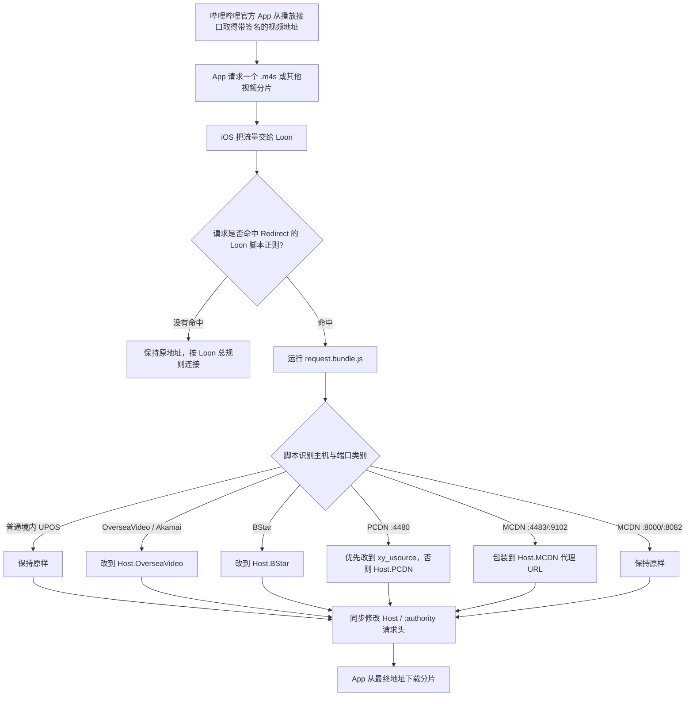

# 用 BiliUniverse/Redirect 和 Loon 给哔哩哔哩官方 App 调整 CDN：零基础原理、配置与验证

> 本文面向不了解网络、IP、DNS、CDN 和 MitM 的读者。
>
> 审读对象：[BiliUniverse/Redirect](https://github.com/BiliUniverse/Redirect) v0.2.20，提交 [`7e44628`](https://github.com/BiliUniverse/Redirect/tree/7e446284790953ad690fee5fa21afe78f00232f5)。
>
> 审读日期：2026-08-04。下文把“源码明确实现的行为”“合理的网络解释”和“尚未解决的实测问题”分开说明。

## 先说结论

`BiliUniverse/Redirect` 不是 VPN 节点，也不会增加宽带带宽。它给 Loon 装入一组请求匹配规则和 JavaScript：当哔哩哔哩官方 App 准备下载视频分片时，Loon 在设备本地拦住请求；脚本判断原地址属于普通 CDN、海外 CDN、BStar、PCDN 还是 MCDN，再按预设规则修改协议、服务器名称或端口，最后让 App 从另一条取视频路线下载同一分片。

最简单的类比是：

- 视频分片是同一件商品；
- URL 中的路径和签名参数是商品编号与提货凭证；
- CDN 主机名是仓库名称；
- Redirect 尝试保留商品编号和凭证，只把取货仓库换掉。

如果卡顿来自“B 站把你分配到了从美国访问很慢或不稳定的仓库”，更换 CDN 可能明显改善播放；如果问题来自 Wi-Fi、运营商总出口、版权限制、账号权限、视频源文件或设备解码，它不会解决。

对中国版哔哩哔哩官方 App，v0.2.20 可以处理一部分海外 CDN、BStar、PCDN 和 MCDN 请求，但它不是“自动测速并永远选择最快 CDN”的工具，也不是当前海外场景下的全覆盖方案。源码和发布版 Loon 插件还存在几个重要缺口：

1. Loon 的脚本规则想匹配普通/海外 `*.bilivideo.com`，但插件的 `[MITM]` 主机列表没有完整包含这些主机；
2. `cn-hk-eq-*` 被列为可选目标，却没有被请求脚本列为需要改走的来源；
3. 带显式 `:80` 的 Akamai URL 不匹配当前 Akamai 脚本正则；
4. MCDN 的 `8000/8082` 路线被识别，但源码明确保持原样；
5. 它使用固定目标，没有内置真实分片测速、自动排名和卡顿后切换。

因此本文给出两种清楚分开的用法：

- **研究或需要 MCDN/PCDN 分类处理**：单独安装官方 `BiliUniverse/Redirect`，从默认阿里云目标开始，按本文方法验证每类请求是否真的被脚本处理。
- **纽约/美国、稳定优先，只想固定普通 UPOS/HK 请求**：优先使用本仓库的 [`Bilibili-US-Accelerator.plugin`](../Bilibili-US-Accelerator.plugin)。它是更窄的 Loon 方案，明确保留 Akamai，不依赖播放时下载远程 JavaScript。

不要同时启用两个插件。它们可能匹配同一条请求；最终由哪条规则先执行会影响结果，也会让排错失去可靠基线。

## 一、先补齐最少的网络知识

### 1. 一个视频地址由什么组成

以一个简化地址为例：

```text
https://upos-sz-mirroraliov.bilivideo.com:443/upgcxcode/12/34/video.m4s?deadline=...&upsig=...
|---|   |---------------------------------| |-| |----------------------------| |----------------------|
协议                  主机名                端口              路径                     查询参数
```

- **协议**：`http` 或 `https`。HTTPS 会加密设备与服务器之间的通信。
- **主机名/域名**：这里是 `upos-sz-mirroraliov.bilivideo.com`，表示要联系哪组服务器。
- **端口**：可以理解为服务器的入口。HTTP 通常是 80，HTTPS 通常是 443；B 站的部分 MCDN/PCDN 会用 4480、4483、8000、8082、9102 等非标准端口。
- **路径**：指出要下载哪个视频或音频分片。
- **查询参数**：常包含有效期、签名和调度信息。它们不是可随便删除的装饰。

Redirect 大多数时候只改变协议、主机名或端口，保留路径与查询参数。MCDN 代理是例外：脚本会把完整原 URL 放进另一个 URL 的 `url=` 参数中。

几个常见缩写可以先这样理解：

| 名称 | 本文中的直白含义 |
| --- | --- |
| UPOS | B 站视频文件使用的一组常规存储/CDN 主机，常见名称中含 `upos-...mirror...` |
| OverseaVideo | Redirect 代码给“海外视频 CDN 来源”起的配置类别名，不是一种网络协议 |
| BStar | 哔哩哔哩国际版相关 CDN 类别 |
| PCDN | 借助更分散的边缘或用户侧资源分发内容的路线；在本项目中主要按 4480 等 URL 特征处理 |
| MCDN | `*.mcdn.bilivideo.cn` 这一组移动/媒体分发主机；脚本还会根据路径和端口细分 |
| Akamai | B 站使用的第三方商业 CDN，常见主机后缀是 `akamaized.net` |
| `.m4s` | DASH 播放使用的音频或视频媒体分片之一 |
| Range / `206` | App 只请求文件某一段字节；服务器成功返回部分内容时常见状态码是 `206` |

这些是为阅读代码服务的工作定义，不应理解成 B 站对每条内部产品线的完整官方命名。Redirect 真正依据的是具体主机、端口、路径和查询参数，而不是只看缩写猜测。

### 2. DNS、IP 和 CDN 分别是什么

- **DNS**像通讯录，把主机名查成设备可以连接的 IP 地址。
- **IP**像服务器的网络门牌号。
- **CDN**是一组分布在不同地区、不同运营商网络里的视频仓库。B 站不用一台中心服务器服务所有用户，而是把视频分发到多个节点。

同一个 CDN 名称对纽约、洛杉矶、东京和上海用户的表现可能完全不同；同一个地点在不同时段也可能走不同 IP 和网络路径。名称里写着“海外”不等于此刻一定快，名称里没有“海外”也不等于美国用户一定慢。

### 3. 为什么只换主机名就可能更快

App 已经拿到了同一视频分片的路径和签名。如果另一组兼容的 B 站 UPOS/CDN 服务器也接受这份路径和签名，那么换主机名就相当于换仓库取同一件商品。新的网络线路可能：

- 距离更合适；
- 与本地运营商互联更好；
- 缓存中已有这个分片；
- 没有被分配到不稳定的边缘或家庭宽带节点。

这只是成立条件，不是互联网通用定律。不同 CDN 可能使用不同签名、缓存键、Range 处理或授权规则。Redirect 源码也特别说明，Akamai 不能被当成其他 CDN 的任意目标；作者只假设从特定 Akamai 地址改到普通 UPOS 是可行的（[`request.js` L118-L129](https://github.com/BiliUniverse/Redirect/blob/7e446284790953ad690fee5fa21afe78f00232f5/src/request.js#L118-L129)）。本仓库在纽约实测中遇到过 Akamai 跨 CDN 后的花屏风险，所以稳定版选择保留 Akamai。这两种行为边界不能混为一谈。

### 4. Loon 在这里是什么

Loon 是设备本地的流量处理器。它通过 iOS/iPadOS 的 VPN 能力接收流量，再执行分流、重写或脚本。Loon 官方手册把插件定义为规则、复写和脚本的集合，也就是一份“子配置”（[Loon 插件说明](https://github.com/Loon0x00/LoonManual/blob/4311d0030fe3065d4664b403a32010f083b99273/docs/cn/plugin.md#L1-L34)）。

这里的“VPN”主要表示系统把流量交给 Loon，并不自动意味着流量会经过某个海外或中国代理服务器。Redirect 本身没有 `[Rule]` 和代理策略；它负责改 URL，改写后的连接最终是直连还是走代理，仍由你的 Loon 总分流规则决定。

## 二、官方 App 的一次视频请求经历什么



这张图有两个容易误解的重点：

1. Redirect 不需要先修改官方 App 的播放接口响应。发布版 Loon 插件使用的全部是 `http-request` 脚本，在分片请求即将发出时改 URL（[Loon 模板 L19-L24](https://github.com/BiliUniverse/Redirect/blob/7e446284790953ad690fee5fa21afe78f00232f5/template/loon.handlebars#L19-L24)）。
2. 设置一个目标主机，不代表所有视频流量都会被送到它。只有先命中 Loon 规则、再被脚本分类为对应来源的请求才会改写。

## 三、发布版 Loon 插件实际包含什么

v0.2.20 的发布资产是一个 32 行插件，核心分成四块。

### 1. `[Argument]`：让用户选择目标

插件提供六个选项：

| 选项 | 它控制什么 | 默认值 | 对中国版官方 App 的重要性 |
| --- | --- | --- | --- |
| `Host.OverseaVideo` | 海外 UPOS、AWS 和 `upos-hz-mirrorakam` 的目标 | `upos-sz-mirrorali.bilivideo.com` | 高 |
| `Host.BStar` | 哔哩哔哩国际版/BStar CDN 的目标 | `upos-sz-mirrorali.bilivideo.com` | 通常较低 |
| `Host.PCDN` | `:4480` PCDN 没有 `xy_usource` 时的后备目标 | `upos-sz-mirrorali.bilivideo.com` | 中到高 |
| `Host.MCDN` | `:4483/:9102` MCDN 的包装代理 | `proxy-tf-all-ws.bilivideo.com` | 中；当前只有这一个选项 |
| `Storage` | 设置从插件参数、BoxJs 还是代码默认值读取 | `Argument` | 建议保持默认 |
| `LogLevel` | 脚本日志详细度 | `WARN` | 排错时改 `INFO` 或 `DEBUG` |

前三类目标可从普通阿里/腾讯/华为、它们的海外版本以及几个香港 Equinix IX 主机中选择。完整选项来自构建配置（[`arguments-builder.config.ts` L30-L230](https://github.com/BiliUniverse/Redirect/blob/7e446284790953ad690fee5fa21afe78f00232f5/arguments-builder.config.ts#L30-L230)），默认值也写在内置数据库中（[`database.mjs` L1-L16](https://github.com/BiliUniverse/Redirect/blob/7e446284790953ad690fee5fa21afe78f00232f5/src/function/database.mjs#L1-L16)）。

`Storage = Argument` 的直白含义是：优先相信你在 Loon 插件页面选的值；缺项再读 BoxJs。选择 `PersistentStore` 会只读 BoxJs，选择 `database` 会忽略用户配置、只用代码默认值。初学者保持 `Argument` 最不容易出现“我明明改了选项，脚本却没变”的情况（[v0.2.20 发布说明](https://github.com/BiliUniverse/Redirect/releases/tag/v0.2.20)）。

### 2. `[General]`：让非标准端口进入 HTTP 引擎

插件配置：

```ini
force-http-engine-hosts = *:4480, *:4483, *:8000, *:8082, *:9102
```

Loon 默认不会为了性能解析所有非标准端口上的原始 TCP HTTP 流量。`force-http-engine-hosts` 告诉它要把这些端口交给 HTTP 引擎，这样脚本才有机会看到并修改请求（[Redirect Loon 模板 L16-L17](https://github.com/BiliUniverse/Redirect/blob/7e446284790953ad690fee5fa21afe78f00232f5/template/loon.handlebars#L16-L17)，[Loon 参数说明](https://github.com/Loon0x00/LoonManual/blob/4311d0030fe3065d4664b403a32010f083b99273/docs/cn/general.md#L100-L106)）。

它不是“这些端口自动更快”，也不是“把所有流量送去代理”；只是允许 Loon 解析。

### 3. `[Script]`：五条入口规则

| 规则 | 想捕获的请求 |
| --- | --- |
| `.+\.bilivideo\.com/upgcxcode/` | 普通 UPOS、海外 UPOS、BStar、部分其他 `bilivideo.com` 视频分片 |
| `*.mcdn.bilivideo.cn[:8000/:8082]/v1/resource/` | 第一类 MCDN 分片 |
| `*.mcdn.bilivideo.cn[:4483/:9102]/upgcxcode/` | 第二类 MCDN 分片 |
| `任意主机:4480/upgcxcode/` | PCDN 分片 |
| `upos-(hz|bstar1)-mirrorakam.akamaized.net/upgcxcode/` | 两类 Akamai 分片 |

所有入口最终运行同一个固定版本的 `request.bundle.js`。Loon 的 `http-request` 脚本可以把 `$request.url` 和请求头交给脚本，脚本通过 `$done(...)` 返回修改后的请求（[Loon http-request API](https://github.com/Loon0x00/LoonManual/blob/4311d0030fe3065d4664b403a32010f083b99273/docs/cn/script.md#L3-L31)）。

### 4. `[MITM]`：允许 Loon 看见部分 HTTPS 请求

发布版列出：

```ini
hostname = *.mcdn.bilivideo.cn, upos-sz-mirror*bstar1.bilivideo.com, upos-*-mirrorakam.akamaized.net
```

HTTPS 会把路径和查询参数加密。要按 `/upgcxcode/` 这样的路径匹配并改写 HTTPS 请求，Loon 通常需要在设备本地解密再重新加密，也就是这里的 MitM。设备必须信任 Loon 自己生成的 CA 证书。

这会带来真实的安全责任：Loon 能解密受 MitM 范围覆盖的 HTTPS 流量；当前 `http-request` 脚本会收到请求 URL 和请求头，未来脚本更新也可能改变处理内容。Loon 官方提醒用户谨慎下载他人脚本（[隐私与免责声明](https://github.com/Loon0x00/LoonManual/blob/4311d0030fe3065d4664b403a32010f083b99273/docs/cn/privacy.md#L1-L10)）。只从项目官方发布地址安装，停止使用时关闭 MitM 或移除不再需要的 CA。

## 四、请求脚本怎样分类和改写

### 1. 普通境内 UPOS：不动

脚本把一批普通阿里、腾讯、华为 UPOS 主机列为已知正常来源，例如：

```text
upos-sz-mirrorali.bilivideo.com
upos-sz-mirrorcos.bilivideo.com
upos-sz-mirrorhw.bilivideo.com
```

命中这些主机时直接 `break`，URL 保持原样（[`request.js` L103-L117](https://github.com/BiliUniverse/Redirect/blob/7e446284790953ad690fee5fa21afe78f00232f5/src/request.js#L103-L117)）。因此它的默认逻辑不是“把所有 B 站视频强制固定到阿里云”，而是只改被列为特定类别的来源。

### 2. 海外 UPOS 与指定 Akamai：改到 `Host.OverseaVideo`

源码列出：

```text
upos-hz-mirrorakam.akamaized.net
upos-sz-mirrorawsov.bilivideo.com
upos-sz-mirroraliov.bilivideo.com
upos-sz-mirrorcosov.bilivideo.com
upos-sz-mirrorhwov.bilivideo.com
```

它们的 `hostname` 会被替换为 `Settings.Host.OverseaVideo`（[`request.js` L118-L124](https://github.com/BiliUniverse/Redirect/blob/7e446284790953ad690fee5fa21afe78f00232f5/src/request.js#L118-L124)）。默认目标是普通阿里云 `mirrorali`。

注意：这个分类把“海外 UPOS”和一个 Akamai 来源绑定到同一个设置。v0.2.20 没有“只改海外 UPOS、保留 Akamai”的独立开关。

### 3. BStar：改到 `Host.BStar`

脚本对阿里、腾讯、华为的 `*bstar1` 以及 `upos-bstar1-mirrorakam` 使用独立目标（[`request.js` L125-L130](https://github.com/BiliUniverse/Redirect/blob/7e446284790953ad690fee5fa21afe78f00232f5/src/request.js#L125-L130)）。这是国际版哔哩哔哩路线；只使用中国版官方 App 的用户通常不需要专门调整它。

### 4. PCDN `:4480`：先相信 `xy_usource`

脚本遇到 4480 端口会：

1. 把协议改成 HTTP；
2. 如果查询参数有 `xy_usource`，使用它指定的主机；
3. 否则才使用你选择的 `Host.PCDN`；
4. 清除 4480 端口。

对应代码见 [`request.js` L175-L179](https://github.com/BiliUniverse/Redirect/blob/7e446284790953ad690fee5fa21afe78f00232f5/src/request.js#L175-L179)。所以 `Host.PCDN = mirrorali` 并不保证每条 PCDN 都改到 `mirrorali`；带 `xy_usource` 的请求会优先服从原调度信息。

### 5. MCDN 是两套不同处理

#### `/v1/resource/`，端口 8000/8082

如果原 URL 没写端口，脚本会按协议补上 8000 或 8082；如果已经是这两个端口，随后保持原样（[`request.js` L133-L160](https://github.com/BiliUniverse/Redirect/blob/7e446284790953ad690fee5fa21afe78f00232f5/src/request.js#L133-L160)、[`L180-L182`](https://github.com/BiliUniverse/Redirect/blob/7e446284790953ad690fee5fa21afe78f00232f5/src/request.js#L180-L182)）。这不是 CDN 加速替换。

#### `/upgcxcode/`，端口 4483/9102

脚本把请求包装成：

```text
http://proxy-tf-all-ws.bilivideo.com/?url=<经过编码的完整原始 URL>
```

它先清空旧路径与查询参数，再把完整 `$request.url` 放进新的 `url=` 参数；带 `originalUrl` 的请求会跳过，避免再次包装（[`request.js` L183-L192](https://github.com/BiliUniverse/Redirect/blob/7e446284790953ad690fee5fa21afe78f00232f5/src/request.js#L183-L192)）。这不是普通的“只换 host”，而是让一个 `bilivideo.com` 代理入口接收原地址。

### 6. 最后同步请求头

改完 URL 后，脚本同步更新 HTTP/1.1 的 `Host` 或 HTTP/2 的 `:authority`，再返回请求（[`request.js` L207-L210](https://github.com/BiliUniverse/Redirect/blob/7e446284790953ad690fee5fa21afe78f00232f5/src/request.js#L207-L210)）。只改 URL、不改这些头，服务器仍可能按旧主机处理请求。

### 7. 486 和 9305：源码有分支，不等于 Loon 发布版能触发

源码还有端口 486 和 9305 的处理（[`request.js` L162-L174`](https://github.com/BiliUniverse/Redirect/blob/7e446284790953ad690fee5fa21afe78f00232f5/src/request.js#L162-L174)、[`L193-L198`](https://github.com/BiliUniverse/Redirect/blob/7e446284790953ad690fee5fa21afe78f00232f5/src/request.js#L193-L198)）。但 v0.2.20 Loon 模板的五条正则没有包含 `:486` 或 `:9305`，`force-http-engine-hosts` 也没有这两个端口。因此不能仅凭脚本里“写了 case”就宣称发布版 Loon 插件已经覆盖这些请求；入口匹配必须先发生。

## 五、Loon 安装与推荐配置

### 准备条件

- iPhone/iPad 上已安装 Loon 和中国版哔哩哔哩官方 App；
- Loon 可以正常开启本地 VPN；
- 愿意安装并完全信任 Loon 自己生成的 CA 证书；
- 只启用一个会改写 B 站视频 CDN 的插件。

插件声明的最低系统版本为 iOS/iPadOS 15；实际兼容性还取决于当前 Loon 和 B 站 App 版本。

### 第 1 步：安装官方发布版插件

[点击在 Loon 中导入 BiliUniverse/Redirect](https://www.nsloon.com/openloon/import?plugin=https%3A%2F%2Fgithub.com%2FBiliUniverse%2FRedirect%2Freleases%2Flatest%2Fdownload%2FBiliBili.Redirect.plugin)

也可以在 Loon 的插件页面添加这个远程 URL：

```text
https://github.com/BiliUniverse/Redirect/releases/latest/download/BiliBili.Redirect.plugin
```

`latest/download` 会跟随项目最新 release；更新可能改变行为。排错时先记下插件详情中的版本。本文核对的是 v0.2.20，SHA-256 为：

```text
73d93fc98e4d450fe760fbc03fd9bbfd2b66ba51b27a908d56fac60edb18005d
```

Loon 的统一链接规范明确支持 `import?plugin=encode(url)`（[Loon Scheme 手册](https://github.com/Loon0x00/LoonManual/blob/4311d0030fe3065d4664b403a32010f083b99273/docs/cn/scheme.md#L21-L36)）。

### 第 2 步：先使用一组可解释的设置

美国/纽约、中国版官方 App 的起始配置建议：

```text
Host.OverseaVideo = upos-sz-mirrorali.bilivideo.com
Host.BStar        = upos-sz-mirrorali.bilivideo.com
Host.PCDN         = upos-sz-mirrorali.bilivideo.com
Host.MCDN         = proxy-tf-all-ws.bilivideo.com
Storage           = Argument
LogLevel          = INFO（验证完成后改回 WARN）
```

这是“容易解释、与项目默认值一致”的起点，不是“阿里云在全美国永远最快”的结论。若镜像阿里不稳定，再单独测试 `mirrorcos`、`mirrorhw` 或海外候选。一次只改一个选项。

### 第 3 步：生成、安装并信任 MitM 证书

Loon 的界面文字会随版本调整，原则不变：

1. 在 Loon 的 MitM/证书设置中生成 CA；
2. 按 Loon 提示把证书描述文件下载到系统；
3. 打开 iOS/iPadOS“设置”，安装刚下载的描述文件；
4. 再到“设置 → 通用 → 关于本机 → 证书信任设置”，对该根证书开启完全信任；
5. 回到 Loon，确认 MitM 功能已开启。

Apple 明确说明：手动安装的根证书不会自动获得 SSL/TLS 完全信任，必须在“证书信任设置”中另行开启（[Apple：信任手动安装的证书](https://support.apple.com/en-us/102390)）。描述文件下载后也需要回到“设置”完成安装（[Apple：安装配置描述文件](https://support.apple.com/en-mide/102400)）。

CA 私钥应只保存在你的设备/Loon 中。不要安装来源不明的 CA，也不要导出并分享自己的 MitM 私钥。

### 第 4 步：让官方 App 的流量确实经过 Loon

建议：

1. 开启 Loon；
2. 代理模式使用 `TUN Only`；
3. 流量模式使用“自动分流/分流”，而不是为了这个插件把所有流量全局代理；
4. 确认脚本、重写和 MitM 总开关没有被关闭；
5. 完全退出哔哩哔哩 App，再重新打开并播放视频。

Loon 手册说明 iOS 流量可能通过 HTTP Proxy 或 TUN 交给 Loon；被 `bypass-tun` 或 `skip-proxy` 排除的目标不会进入 Loon（[Loon General 说明](https://github.com/Loon0x00/LoonManual/blob/4311d0030fe3065d4664b403a32010f083b99273/docs/cn/general.md#L4-L13)）。若你的全局配置自行排除了 `*.bilivideo.com`、`*.bilivideo.cn` 或相关 IP，插件也无法处理它们。

### 第 5 步：验证“真的改了”，不要只凭主观感觉

选择一个容易复现卡顿的视频，固定清晰度，先在插件关闭时记录基线，再开启插件测试。至少检查：

1. Loon 请求记录中出现 `BiliBili.Redirect...` 脚本标签或对应脚本日志；
2. 日志中的原始 URL 属于哪类主机和端口；
3. 最终请求 URL 的主机是否变为所选目标；
4. HTTP 状态是否是成功的 `200` 或分片/Range 常见的 `206`；
5. 是否出现 `403`、循环重定向、画面损坏、音画不同步；
6. 同一视频、相同清晰度下，缓冲次数和持续下载速度是否改善。

不要只看 ping。视频需要的是持续吞吐和稳定 Range 下载；“服务器很快回了第一句话”不等于“能持续高速搬完视频”。每个目标最好重复 2–3 次，并在相近时段测试，避免把一次缓存命中或瞬时拥塞误认为长期结论。

## 六、v0.2.20 在 Loon 上的已知边界

### 1. `[Script]` 想匹配的范围大于 `[MITM]` 实际列出的范围

脚本第一条规则匹配 `.+.bilivideo.com/upgcxcode/`，理论上包含普通 UPOS、`*ov` 和 `cn-hk-eq-*`；但 `[MITM]` 只列出 MCDN、BStar 和 Akamai（[Loon 模板 L19-L27](https://github.com/BiliUniverse/Redirect/blob/7e446284790953ad690fee5fa21afe78f00232f5/template/loon.handlebars#L19-L27)）。

对 HTTPS 请求，Loon 若不能解密路径，就无法可靠按 `/upgcxcode/` 执行路径正则。因此“正则能在纸面上匹配”不等于“官方 App 的 HTTPS 请求一定触发脚本”。这是当前模板的静态配置缺口，不是 CDN 速度问题。

### 2. `cn-hk-eq-*` 可以当目标，却不会被当前分类器改走

v0.2.20 新增了多个香港 Equinix IX 主机作为 `Host.OverseaVideo/BStar/PCDN` 的可选值（[v0.2.20 release](https://github.com/BiliUniverse/Redirect/releases/tag/v0.2.20)）。但 `request.js` 的来源 `switch` 没有 `cn-hk-eq-*` case；这类无显式端口的 URL 进入 `default` 后也不满足 MCDN 条件，最终保持原样。

所以：

- 你可以把其他已分类来源改到 `cn-hk-eq-01-09.bilivideo.com`；
- 但 B 站本来就给你的 `cn-hk-eq-01-09.bilivideo.com` 请求不会因为 `Host.OverseaVideo = mirrorali` 而改走。

### 3. 显式 `:80` 的 Akamai 不匹配当前正则

当前 Akamai 规则要求主机名后立刻出现 `/upgcxcode/`：

```text
http://upos-hz-mirrorakam.akamaized.net/upgcxcode/...     能匹配
http://upos-hz-mirrorakam.akamaized.net:80/upgcxcode/... 不能匹配
```

`force-http-engine-hosts` 也没有明确列出 `*:80`，虽然 Loon 通常默认解析 HTTP 80。这里真正的问题是正则不接受显式端口。

### 4. MCDN 并非全部重定向

`8000/8082` 的 `/v1/resource/` 只会被补端口或保持原样；只有 `4483/9102` 的 `/upgcxcode/` 会被包装到 MCDN proxy。看到“插件识别了 MCDN”不能推导成“所有 MCDN 都已经加速”。

### 5. 486/9305 处理可能是不可达分支

源码支持不代表当前 Loon 入口会触发。发布模板没有相应端口的强制 HTTP 引擎配置和脚本匹配，需要项目进一步补齐模板或另有上游 URL 先被转换，才能实际进入这些 case。

### 6. 没有动态测速和自动故障切换

插件不会拿同一个真实分片测试所有候选，也不会因播放器持续卡顿自动改选下一个 host。用户选择的 `Host.*` 是固定配置；CDN 状况变化后，需要手动复测和更换。

### 7. 公开 issue 已报告同类海外覆盖问题

截至 2026-08-04，[Redirect issue #10](https://github.com/BiliUniverse/Redirect/issues/10) 仍是开放状态。报告者在海外环境观察到 `*ov:443`、`cn-hk-eq-*:443` 和 Akamai `:80` 没有触发重定向，并指出 MitM、主机分类和显式端口覆盖问题。Issue 是用户报告，不等于维护者已经确认所有现象；但其中的正则和主机列表缺口可以直接从 v0.2.20 模板与源码复核。

## 七、官方 Redirect 与本仓库稳定版有什么不同

| 维度 | BiliUniverse/Redirect v0.2.20 | 本仓库 `Bilibili-US-Accelerator.plugin` |
| --- | --- | --- |
| 核心方法 | Loon `http-request` 运行远程 JavaScript 分类并改 URL | Loon `[Rewrite]` 直接改请求头中的 URL host |
| 目标配置 | OverseaVideo、BStar、PCDN 可选多种目标 | 固定 `upos-sz-mirrorali.bilivideo.com` |
| 普通境内 UPOS | 已知普通主机保持原样 | 匹配的普通 UPOS/HK 均固定到 mirrorali |
| 海外 UPOS | 计划改到 `Host.OverseaVideo`，但 Loon MitM 范围有缺口 | `upos-*.bilivideo.com` 在 MitM 范围内时直接改写 |
| `cn-hk-eq-*` | 可当目标；当前不能作为来源被分类改走 | 显式匹配并改写 |
| Akamai | `hz/bstar1` 来源计划改到普通 UPOS | 明确保留，不改写 |
| PCDN | 处理 `:4480`，优先 `xy_usource` | 只覆盖正则命中的 `bilivideo.com` 主机 |
| MCDN | 部分保持原样、部分走 `proxy-tf-all-ws` | 不处理 `*.mcdn.bilivideo.cn` |
| 动态测速 | 无 | 无 |
| 播放时外部依赖 | 从 GitHub release 载入固定版本脚本 | 无远程 JavaScript；插件本体即规则 |
| 适合场景 | 研究不同 CDN 家族、需要 PCDN/MCDN 逻辑、愿意看日志排错 | 美国网络下普通 UPOS/HK 固定改写、稳定优先 |

两者不是简单的“功能多一定更好”或“规则短一定更好”。Redirect 覆盖的协议分支更多，行为也更复杂；本仓库稳定版故意缩小范围，换取更容易验证的行为，并规避已观察到的 Akamai 兼容风险。

## 八、常见故障怎么判断

### 情况 A：插件完全没有日志

按顺序检查：

1. Loon VPN 是否开启；
2. 是否为 `TUN Only`，请求有没有被 `bypass-tun/skip-proxy` 排除；
3. 插件、脚本、MitM 是否启用；
4. CA 描述文件是否已安装并开启完全信任；
5. 原请求是不是当前五条正则覆盖的路径和端口；
6. HTTPS 主机是否真的在插件 `[MITM]` 列表中。

如果原主机是 `*ov` 或 `cn-hk-eq-*`，优先考虑 v0.2.20 的覆盖缺口，不要先怀疑目标 CDN。

### 情况 B：脚本运行了，但主机没变

可能原因：

- 原主机已是普通境内 UPOS，源码设计就是保持原样；
- 原主机是 `cn-hk-eq-*`，没有来源分类；
- MCDN 是 `8000/8082`，源码明确不替换；
- 所选目标与原主机相同；
- PCDN 带 `xy_usource`，它覆盖了 `Host.PCDN`。

### 情况 C：主机变了，但出现 403、花屏或音画异常

这通常比“速度慢”更像兼容性问题：签名、Range、协议或 CDN 缓存键不接受这次跨主机替换。

1. 立即关闭插件并完全退出 B 站 App；
2. 重新打开，确认原始播放恢复；
3. 换另一个目标主机单独测试；
4. 若原来源是 Akamai，不要假设它一定能安全改到 UPOS；稳定优先时使用保留 Akamai 的本仓库插件；
5. 保留原 URL、修改后 URL、状态码与时间，报告问题时去掉 Cookie、token 等账号敏感信息。

### 情况 D：改写成功，但速度没有改善

这不一定是插件失效。可能是：

- 原 CDN 已经很好；
- 新旧主机最终落到相同或相近网络；
- 当前瓶颈在 Wi-Fi、运营商或代理节点；
- 视频码率高于稳定吞吐；
- 问题是设备解码而非下载；
- 测试只发生了一次，受缓存或瞬时拥塞影响。

关闭插件做同条件基线，再比较，才知道改变来自哪里。

### 情况 E：App 整体无法联网

1. 先关闭插件；
2. 完全退出并重开 B 站 App；
3. 若仍异常，暂时关闭 Loon MitM；
4. 检查是否同时启用了多个 B 站重写插件；
5. 检查 Loon 总分流、代理节点和 DNS，而不是继续更换 CDN host。

## 九、一个可靠的 A/B 测试记录模板

复制下面的表，每个候选至少测试 2–3 次：

| 字段 | 基线 | 候选 A | 候选 B |
| --- | --- | --- | --- |
| 日期与当地时间 |  |  |  |
| Wi-Fi/蜂窝与运营商 |  |  |  |
| B 站 App 版本 |  |  |  |
| Loon 与 Redirect 版本 |  |  |  |
| 视频 BV/AV 号与分 P |  |  |  |
| 清晰度、编码、杜比/HDR |  |  |  |
| 原始主机与端口 |  |  |  |
| 最终主机与端口 |  |  |  |
| HTTP 状态码 |  |  |  |
| Loon 显示的持续下载速度 |  |  |  |
| 60 秒内缓冲次数 |  |  |  |
| 是否花屏/音画异常 |  |  |  |

评价顺序建议是：

1. **正确性**：能稳定返回 200/206，没有花屏、403 和循环；
2. **稳定性**：重复测试结果接近，长视频不频繁掉速；
3. **吞吐量**：持续下载速度高于视频码率，并留有余量；
4. **启动速度**：最后再看首帧和延迟。

不要为了一个更漂亮的瞬时峰值牺牲正确性和稳定性。

## 十、安全、版权与维护边界

- MitM 根证书使设备信任 Loon 为所列主机签发的临时证书。只在自己的设备上使用，只信任自己生成的 CA。
- Redirect 的脚本 URL固定到 release 版本，但插件更新会指向新版本。更新前后都应查看版本与变更说明。
- 这套方法修改取视频路线，不解除地区版权、会员、登录或 DRM 限制。
- CDN 域名、端口、签名规则和 B 站 App 行为都可能变化。某天失效时，应先抓到新的真实请求，再修改规则；不要凭域名名称猜。
- 请遵守当地法律、平台条款和内容授权规则。

## 十一、源码证据索引

| 要核对的结论 | 具体位置 |
| --- | --- |
| Loon 插件的五条入口、非标准端口和 MitM 主机 | [`template/loon.handlebars` L16-L27](https://github.com/BiliUniverse/Redirect/blob/7e446284790953ad690fee5fa21afe78f00232f5/template/loon.handlebars#L16-L27) |
| 普通 UPOS 保持原样 | [`src/request.js` L103-L117](https://github.com/BiliUniverse/Redirect/blob/7e446284790953ad690fee5fa21afe78f00232f5/src/request.js#L103-L117) |
| OverseaVideo、Akamai 和 BStar 改写 | [`src/request.js` L118-L130](https://github.com/BiliUniverse/Redirect/blob/7e446284790953ad690fee5fa21afe78f00232f5/src/request.js#L118-L130) |
| 无端口 MCDN 补端口 | [`src/request.js` L133-L160](https://github.com/BiliUniverse/Redirect/blob/7e446284790953ad690fee5fa21afe78f00232f5/src/request.js#L133-L160) |
| 486、4480、8000/8082、4483/9102、9305 分支 | [`src/request.js` L162-L199](https://github.com/BiliUniverse/Redirect/blob/7e446284790953ad690fee5fa21afe78f00232f5/src/request.js#L162-L199) |
| 同步 `Host` 与 `:authority` 后返回 URL | [`src/request.js` L207-L210](https://github.com/BiliUniverse/Redirect/blob/7e446284790953ad690fee5fa21afe78f00232f5/src/request.js#L207-L210) |
| 四类 Host 目标和 Storage/LogLevel 选项 | [`arguments-builder.config.ts` L30-L258](https://github.com/BiliUniverse/Redirect/blob/7e446284790953ad690fee5fa21afe78f00232f5/arguments-builder.config.ts#L30-L258) |
| 默认目标 | [`src/function/database.mjs` L1-L16](https://github.com/BiliUniverse/Redirect/blob/7e446284790953ad690fee5fa21afe78f00232f5/src/function/database.mjs#L1-L16) |
| 当前稳定 release | [v0.2.20](https://github.com/BiliUniverse/Redirect/releases/tag/v0.2.20) |
| 海外覆盖公开报告 | [issue #10](https://github.com/BiliUniverse/Redirect/issues/10) |

## 十二、一页速查

### 你只想马上试用

1. 只保留一个 B 站 CDN 插件；
2. 导入官方 Redirect；
3. `Storage = Argument`，三个可选 Host 先用 `mirrorali`，日志先用 `INFO`；
4. 安装并完全信任 Loon CA，开启 MitM/脚本；
5. 使用 `TUN Only` 和自动分流；
6. 完全退出并重开 B 站 App；
7. 在 Loon 记录中确认原始 host、最终 host 和 200/206；
8. 若没有日志，先查规则/MitM 覆盖；若 403 或花屏，立刻回滚；
9. 完成验证后把日志改回 `WARN`。

### 你只需要记住三句话

1. 这个插件换的是取视频路线，不是宽带套餐，也不是解锁版权。
2. 选了目标 CDN 不等于所有请求都会去那里；匹配、MitM 和脚本分类缺一不可。
3. “能播放且长期稳定”比一次测速峰值更重要，所有结论都要用同视频、同清晰度的开关前后测试来验证。
