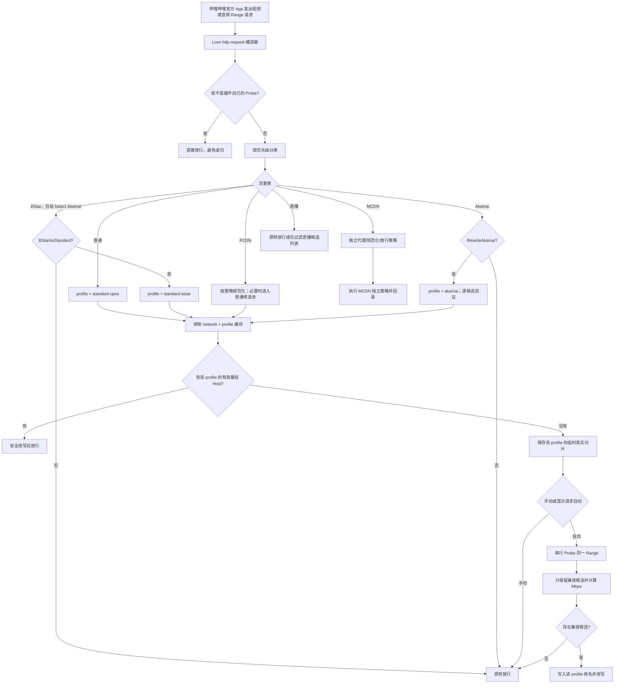

# 在 Loon 中为哔哩哔哩官方 App 实现自动 CDN 测速与选择

> 一份面向实现、测试和审计的详细设计文档
>
> 目标平台：iOS / iPadOS、Loon、哔哩哔哩中国版官方 App<br>
> 文档状态：最初的设计方案；核心功能已在稳定手动版 0.1.8 和实验自动版 0.2.1 实现<br>
> 最后同步：2026-08-12

## 一、结论先行

可以在 Loon 中实现 `bilibili-accelerator` 最核心的“真实分片测速选优”能力：

1. 在哔哩哔哩官方 App 发出视频请求时，由 Loon 的 `http-request` 脚本实时取得 `$request.url`、请求头和 Range；
2. 保留原视频路径、签名和查询参数，只依次替换候选 CDN 主机名；
3. 使用 `$httpClient` 对同一视频文件、同一字节区间发起串行 Range 请求；
4. 根据响应是否兼容、实际返回字节数和总耗时计算有效下载速度；
5. 把当前网络下的最佳 CDN 及排名写入 `$persistentStore`；
6. 后续视频请求直接改写到缓存的最佳 CDN；
7. 候选过期或网络改变后重新测试。

但不能把网页端项目原封不动搬到官方 App：

- Loon 官方公开的 Script API 没有读取“请求记录页面历史列表”的接口；插件必须在请求发生时实时捕获，而不是事后扫描 UI 中的记录；
- 原生 App 没有网页的 `<video>` 元素，Loon 无法直接监听 `waiting`、`stalled` 或缓冲区长度；
- 请求脚本调用 `$done()` 后脚本资源会被释放，不能让原播放请求先继续、同时在同一脚本实例中无限期后台测速；
- Loon 的 `$httpClient` 返回完整响应 Body，没有公开的流式读取和下载到指定字节数后主动取消接口，所以必须依赖服务器正确响应 Range，并严格限制请求大小和超时；
- MCDN、PCDN、Akamai 和直播不是普通 UPOS 的简单别名，不能全部套用“只换 Host”的做法。

当前发布结构保留两个独立 manifest，共用同一套经过测试的脚本：

```text
Bilibili-US-Accelerator.plugin
Bilibili-US-Auto-Accelerator.plugin
scripts/bilibili-auto-cdn.js
```

稳定版固定为 8 候选手动测速，实验版固定为无缓存时的首次请求自动测速。两个插件不能同时启用。

实验插件从分类器的第一版就保留五条明确路径：**普通 UPOS、PCDN、MCDN、Akamai、直播**。这里的“保留”不是把五类地址都粗暴换成同一个 Host，而是先正确识别，再为每一类执行不同策略。普通 UPOS 直接使用真实分片测速选优；PCDN 先规范化再选优；MCDN 使用独立代理/规范化策略；Akamai 默认放行、可选择在兼容性探测成功后改写；直播只处理自己的地址列表，绝不套用点播 Host Swap。

`BStar` 不再作为第六套固定目标。插件增加 `BStarAsStandard` 开关：默认关闭时原样放行；开启时进入普通 UPOS 的同一候选池和测速流程，并改写到对当前 BStar 分片实测兼容且最快的候选。为避免普通视频的旧缓存未经验证就污染 BStar，二者使用独立的兼容性缓存命名空间。

## 二、为什么值得做

本项目最初的 0.1.0 稳定版把普通 UPOS/HK 视频请求固定到：

```text
upos-sz-mirrorali.bilivideo.com
```

它的优点是简单、可预测、容易排错；缺点是固定节点不可能对所有地点、运营商、时间和视频都最优。

同一 CDN 对不同网络的表现可能完全相反：

- 纽约家庭宽带与西雅图、东京、中国大陆的最佳节点可能不同；
- 同一家庭网络在晚高峰和凌晨可能不同；
- 热门视频可能已经在某个边缘节点缓存，冷门视频可能需要回源；
- CDN 域名背后对应的 IP 和调度结果也会随时间变化。

用户此前在当前网络中得到的浏览器初步结果是：

| 候选主机 | 三轮中位速度 | 中位响应时间 |
| --- | ---: | ---: |
| `upos-sz-mirroraliov.bilivideo.com` | 299.59 Mbps | 240 ms |
| `upos-tf-all-hw.bilivideo.com` | 299.59 Mbps | 237 ms |
| `upos-tf-all-tx.bilivideo.com` | 294.34 Mbps | 239 ms |
| `upos-sz-mirrorali.bilivideo.com` | 153.92 Mbps | 238 ms |

这组结果说明在当时的网络和测试样本中，前三个候选的短时吞吐量约为固定 `mirrorali` 的两倍。但它不能直接证明官方 App 的所有视频都会得到两倍体验：前三个结果接近测试上限，所有候选也都已经远高于大多数视频的持续码率需求。真正需要验证的是官方 App 的首帧时间、Range 请求稳定性、拖动恢复和失败率。

自动测速插件的价值，不是承诺“永远更快”，而是把固定经验改为当前设备、当前网络、当前真实视频分片上的可重复测量。

## 三、与两个参考项目的关系

### 1. `realzza/bilibili-accelerator`

网页端 [`realzza/bilibili-accelerator`](https://github.com/realzza/bilibili-accelerator) 的当前核心思路是：

- 从播放数据中取得真实的带签名分片 URL；
- 将同一个 URL 的 Host 换成候选 CDN；
- 使用 Range 请求读取每个候选的一小段数据；
- 按吞吐量排序并缓存；
- 给播放器补充备用 URL；
- 监听网页播放器的卡顿事件，必要时轮换候选。

其测速代码可见 [`bili-accelerator.page.js`](https://github.com/realzza/bilibili-accelerator/blob/6cba8c8b23ad01a152d186420081284b6eda1f77/src/page/bili-accelerator.page.js#L745-L900)。该版本最多读取每个候选前 768 KiB、为单候选设置 4 秒超时，并以短时真实分片下载替代只测 ping。

Loon 版可以复用“同一真实分片、替换 Host、Range 测速、缓存排名”的核心；不能复用 DOM 播放状态、网页播放器备用 URL 和浏览器 AbortController 的完整闭环。

### 2. `BiliUniverse/Redirect`

[`BiliUniverse/Redirect`](https://github.com/BiliUniverse/Redirect) 提供了官方 App 网络层分类的重要参考：

- 普通 UPOS；
- OverseaVideo / `*ov`；
- BStar；
- PCDN；
- MCDN；
- Akamai。

其请求处理见 [`request.js`](https://github.com/BiliUniverse/Redirect/blob/7e446284790953ad690fee5fa21afe78f00232f5/src/request.js)。设计自动测速插件时应借用这种分类边界，而不是看到任何视频域名都强制替换。

特别要保留以下认识：

- 普通 UPOS 包含普通镜像、海外 `*ov`、`tf-all-*` 和香港 `cn-hk-eq-*`。这些来源共享一个候选池，但每个候选仍必须用当前真实分片的 `206` 响应验证；
- BStar 只有在 `BStarAsStandard=true` 时才进入普通处理管线，而且必须先用 BStar 自己的签名 URL 建立兼容性证明；
- PCDN 可能包含 `xy_usource`、纯 IP、已知 P2P 域名、`os=mcdn` 或非标准端口，需要先去掉 PCDN 特有的传输外壳，再测试普通 UPOS 候选；
- MCDN 的 `proxy-tf-all-ws` 处理是“包装原始 URL 给代理”，不是普通 Host Swap；
- Akamai 可能使用不同签名或 Range 约定，因此默认放行。即使打开改写，也只能把普通候选逐个测试后选择兼容者，不能把 Akamai 本身加入普通候选池；
- 直播 `/live-bvc/` 使用另一套地址结构，只能在直播地址列表内部过滤或排序，不能使用点播 UPOS 候选池。

## 四、Loon 平台能提供什么

以下能力来自 Loon 当前官方文档。

### 1. 实时捕获请求

Loon 的 `http-request` 脚本在 HTTP 请求发出前运行，可以读取：

```text
$request.url
$request.method
$request.headers
$request.body
```

并通过 `$done({ url, headers, node })` 修改 URL、请求头或使用的策略。见 [Loon 脚本类型文档](https://nsloon.app/docs/Script/)。

因此插件不需要、也不能依赖读取抓包历史。只要请求命中 `[Script]` 中的正则，它发生时就会直接进入脚本。

### 2. 主动发起测速请求

Loon 的 `$httpClient.get()` 支持：

- 自定义 URL；
- 自定义 Header；
- 毫秒级超时；
- 指定节点或策略；
- `binary-mode` 二进制响应；
- HTTP/1.1 或 HTTP/2。

官方参数说明见 [Loon Script API](https://nsloon.app/docs/Script/script_api/#网络请求)。测速应启用：

```javascript
{
  url: candidateUrl,
  timeout: 3000,
  headers: {
    Range: "bytes=0-1048575"
  },
  "binary-mode": true,
  "auto-cookie": false,
  "auto-redirect": false
}
```

### 3. 保存测速结果

`$persistentStore.write()` 和 `$persistentStore.read()` 只保存字符串，因此状态应先序列化为 JSON。它适合保存：

- 当前网络标识；
- 候选列表指纹；
- 最佳 Host；
- 完整排名；
- 测试时间和过期时间；
- 临时的已捕获分片 URL；
- 测速锁和失败计数。

官方文档中的 `$persistentStore.remove()` 是清除脚本 API 保存的全部数据，并没有承诺按指定 key 删除。实现时不要为了删除一条临时 URL 调用它；应把对应 key 覆写为空字符串或已过期的 tombstone 记录，完整重置功能才使用 `remove()`。

### 4. 获取当前 Wi-Fi 名称

`$config.getConfig()` 返回的 JSON 包含 `ssid`。它可以作为粗略网络键：同一设备在家庭 Wi-Fi、学校 Wi-Fi 和蜂窝网络上分别保存结果。

SSID 不是完整的网络身份：同名 Wi-Fi 可能属于不同网络，蜂窝网络也可能在不同基站和出口间变化。但它比网页项目使用时区和浏览器语言区分网络更直接。

### 5. 手动与自动入口

Loon 支持：

- `http-request`：请求发生时执行；
- `http-response`：响应返回后执行；
- `generic`：由用户在 Loon 中手动执行；
- `cron`：定时执行；
- `network-changed`：网络变化时执行。

本方案主要使用 `http-request` 和 `generic`。不建议默认每分钟运行 Cron，因为它会长期唤醒脚本，却经常没有一条仍有效的签名 URL 可测。

## 五、目标、非目标与流量分类边界

### 目标

方案应完成：

1. 把官方 App 的媒体流量分成普通、PCDN、MCDN、Akamai、直播五类；
2. 把 `*ov`、`tf-all-*` 和 `cn-hk-eq-*` 纳入普通候选测速机制；
3. 保存一条短期有效的真实签名 URL，串行测试候选 Host；
4. 验证候选是否真正支持当前对象和 Range，再计算有效 Mbps；
5. 按当前网络和兼容性档案缓存最佳 Host；
6. 为 PCDN、MCDN、Akamai 和直播执行各自的策略，而不是共用一个不安全的 Host Swap；
7. 提供 `BStarAsStandard` 开关，决定 BStar 是原样放行还是进入普通候选池测速改写；
8. 提供手动测速和首次请求自动测速两种模式；
9. 防止 Probe 递归、并发重复测速和跨类别缓存误用；
10. 所有失败都回到原始 URL，且不在日志和通知中泄露完整签名 URL。

### 非目标

明确不做：

- 不提高用户宽带套餐上限；
- 不解锁版权或地区限制；
- 不重新编码或降低视频画质；
- 不把 PCDN、MCDN、Akamai 或直播假装成普通 UPOS；
- 不把普通 UPOS 的测速缓存未经验证直接用于 BStar 或 Akamai；
- 不把 Akamai/BStar 来源主机加入普通候选目标池；
- 不把点播最佳 Host 写进直播 `/live-bvc/`；
- 不宣称最快节点对所有视频永久最快；
- 不通过读取 Loon UI 历史记录工作；
- 不准确判断官方 App 的播放器缓冲区和卡顿事件；
- 不替代 Loon 请求记录和人工 A/B 验证。

### 分类矩阵

| 流量类 | 典型信号 | 默认处理 | 是否使用普通候选池 |
| --- | --- | --- | --- |
| 普通 | `upos-*.bilivideo.com/upgcxcode/`、`cn-hk-eq-*`，默认端口；包括 `*ov`、`tf-all-*` | 对当前真实分片串行测速，改写到最快兼容候选 | 是 |
| PCDN | `:4480`、纯 IP、已知 P2P 域名、`os=mcdn`、`xy_usource`、302 中转等启发式信号 | 先规范化，再按 `PCDNStrategy` 选择 `best-upos`、`xy-usource` 或放行 | `best-upos` 时是 |
| MCDN | `*.mcdn.bilivideo.{cn,com,net}`，常见 `/v1/resource/` 或带 4483/9102 的 `/upgcxcode/` | 独立执行 `proxy-all`、`proxy-upgcxcode`、`best-upos` 或放行 | 只有 `best-upos` 时是 |
| Akamai | `upos-*-mirrorakam.akamaized.net/upgcxcode/` | 默认放行；打开 `RewriteAkamai` 后才逐个探测普通候选 | 开关打开时是，但 Akamai 不是候选目标 |
| 直播 | `/live-bvc/` 或播放接口 `url_info` 中的直播地址 | 默认放行；可选只在直播列表内部过滤 PCDN/MCDN 项 | 否 |

`BStar` 是横跨 UPOS/Akamai 命名的内容家族，而不是第六套加速策略：

- `BStarAsStandard=false`（默认）：识别后原样放行；
- `BStarAsStandard=true`：使用普通候选池、同一串行测速算法和改写函数；
- 但结果写入 `standard-bstar`，不能直接读取 `standard-upos` 的兼容性缓存；
- BStar 来源主机本身不能反向成为普通候选目标。

### 分类优先级

分类器按以下顺序执行，命中后停止：

```text
Probe 递归标记
→ 直播
→ MCDN
→ PCDN
→ BStar
→ Akamai
→ 普通 UPOS
→ 未知媒体地址
```

`MCDN` 必须先于宽泛的 PCDN 端口启发式，否则一个 `*.mcdn.*:4483` 地址会被误送进普通 PCDN 规范化。`BStar` 必须先于 Akamai，这样 `upos-bstar1-mirrorakam.akamaized.net` 才由 `BStarAsStandard` 而不是 `RewriteAkamai` 控制。所有媒体处理还共同要求：方法为 `GET`、URL 可完整解析、查询参数可原样保留、脚本自己的 Probe Header 不存在。

## 六、总体架构



### 组件划分

| 组件 | 责任 |
| --- | --- |
| 请求捕获器 | 匹配合格 URL、提取 Range、保存临时样本、应用缓存 Host |
| 分类器 | 按固定优先级识别普通、PCDN、MCDN、Akamai、直播和 BStar |
| 特殊流量路由器 | 执行 PCDN 规范化、MCDN 代理、Akamai/BStar 开关和直播过滤 |
| Probe 引擎 | 构造候选 URL、串行发送请求、验证响应、计算指标 |
| 排名器 | 过滤不兼容候选、按有效 Mbps 排名、处理并列和失败 |
| 状态存储 | 按网络与 profile 保存结果、管理 TTL、候选指纹、临时 URL 和锁 |
| 手动入口 | 在 Loon 中一键运行测速、强制忽略旧缓存 |
| 自动入口 | 首次合格请求无缓存时阻塞测速，然后改写当前请求 |
| 响应反馈器 | 后续阶段记录 HTTP 错误，为下一请求降级候选 |

## 七、两种运行模式

### 模式 A：捕获后手动一键测速——推荐默认值

流程：

1. 用户正常打开任意点播视频；
2. 捕获器保存最近一条合格的真实分片 URL；
3. 原始请求立即放行，播放不被测速阻塞；
4. 用户进入 Loon，运行 `Bilibili CDN 测速并应用` generic 脚本；
5. Probe 引擎串行测试候选；
6. Loon 通知展示排名；
7. 用户重新打开视频或拖动到未缓存位置；
8. 后续请求改到最佳 Host。

优点：

- 不延迟第一次播放；
- 可以设置更大的 Range 和更多轮次；
- generic 脚本允许较长超时；
- 测速过程容易与普通播放请求区分；
- 发生异常时不会卡住 App 的原始请求。

缺点：

- 第一次需要用户手动点一次；
- 捕获的 URL 有签名有效期，必须在几分钟内运行；
- 测速完成后通常要重新加载或等待下一条 Range 请求。

### 模式 B：首次请求自动测速——可选实验功能

流程：

1. 当前 SSID 没有有效缓存；
2. 第一条合格视频请求进入脚本；
3. 脚本取得测速锁，暂不 `$done()`；
4. 串行测试候选；
5. 保存排名；
6. 把当前请求改写到最佳 Host；
7. `$done({ url, headers })` 放行。

优点：完全自动，同一条请求就能使用刚测出的最佳节点。

缺点：

- 首次播放会增加测速等待；
- 八个候选、每个 3 秒超时的理论最坏时间是 24 秒；
- 必须把 `http-request` 脚本总超时设置得高于单项超时之和；
- 视频和音频请求可能几乎同时触发，需要锁；
- iOS 在脚本长时间占用时可能受资源限制；
- 如果所有候选都失败，必须可靠地回到原始 URL，不能让播放请求消失。

建议自动模式默认参数：

```text
候选数：8
Range：512 KiB
单候选超时：3000 ms
轮次：1
脚本总超时：180 s
缓存：60 min
全失败：原地址放行
```

## 八、候选池设计

### 当前默认候选

基于当前网络的浏览器结果，建议默认候选为：

```text
upos-sz-mirrorcosov.bilivideo.com
upos-sz-mirroraliov.bilivideo.com
upos-sz-mirrorhwov.bilivideo.com
upos-sz-mirrorali.bilivideo.com
upos-tf-all-hw.bilivideo.com
upos-sz-mirrorhw.bilivideo.com
upos-sz-mirrorcos.bilivideo.com
upos-tf-all-tx.bilivideo.com
```

前三个带 `ov` 的主机是海外镜像，其余五个是常规节点。候选顺序只决定串行测试顺序，不是固定优先级；最终选择仍取决于当前网络上的有效测速结果。

### 为什么不立即加入所有节点

候选越多：

- 首次等待越长；
- 额外流量越大；
- 遇到不兼容签名的概率越高；
- 排名更容易受短时网络波动影响；
- iOS 脚本超时和内存风险越高。

初始自动实验版先用四个普通候选验证流程，0.2.1 再扩展为八个。它们同时供普通 UPOS、`BStarAsStandard=true`、`PCDNStrategy=best-upos` 和 `RewriteAkamai=true` 使用；“同一个候选池”只表示目标 Host 列表相同，不表示四种来源共享一条未经复测的兼容性结论。

插件 `[Argument]` 可以允许用户编辑逗号分隔的 Host 列表，但必须对输入做严格校验：

```regex
^[a-z0-9.-]+$
```

并要求后缀属于明确允许的范围，例如：

```text
.bilivideo.com
```

禁止候选中出现：

- 协议；
- `/` 路径；
- `?` 查询参数；
- 用户名或密码；
- 任意 IP；
- 非允许域名后缀。

还应明确拒绝以下目标：

- `*bstar1*`；
- `*.akamaized.net`；
- `*.mcdn.bilivideo.{cn,com,net}`；
- `proxy-tf-all-ws.bilivideo.com`；
- 已知 PCDN/P2P 主机以及带非标准端口的值。

这不仅是输入清洁问题，也是 SSRF 和意外泄露签名 URL 的安全边界。否则用户配置的恶意 Host 可以收到带签名的完整视频路径。

## 九、捕获真实分片 URL

### 为什么必须使用真实 URL

测速不能只请求候选首页，也不能只 ping：

- CDN 首页和视频文件可能使用不同缓存、路由和权限；
- ping 测的是往返延迟，不是持续下载速度；
- 真正的视频 URL 带有路径、签名、有效期和 Range 语义；
- 同一个分片更能保证候选之间测试的是同一对象。

### 应保存哪些内容

临时样本只需要：

```json
{
  "url": "完整但仅短期保存的原始分片 URL",
  "range": "bytes=123456-",
  "userAgent": "必要时保存",
  "referer": "必要时保存",
  "capturedAt": 1785879000000,
  "expiresAt": 1785879300000,
  "sourceHost": "upos-sz-mirrorali.bilivideo.com",
  "trafficClass": "ordinary",
  "profile": "standard-upos"
}
```

不建议保存：

- Cookie；
- 完整 App 请求头；
- 设备标识头；
- Authorization；
- 与测速无关的追踪 Header。

大多数视频权限已经体现在 URL 查询参数中。若实测发现候选需要 `User-Agent`、`Referer` 或 `Origin`，再按最小权限原则补充。

### URL 重建规则

必须：

- 保留协议，除非有经验证的特殊规范化规则；
- 只替换 hostname；
- 普通、BStar 和 Akamai 直接 Host Swap 只接受默认 HTTP/HTTPS 端口；
- 完整保留 pathname；
- 完整保留查询参数及其编码；
- 不重新排列签名参数；
- 不 decode 后再用不等价方式 encode；
- 同步更新 `Host` 或 `:authority`；
- 保留 App 原始播放请求的 Range。

PCDN/MCDN 的协议、端口或包装变化不能偷偷塞进这个通用函数，必须由对应策略先构造一个完整目标 URL，再进入共同的响应验证。直播地址永远不进入这个重建函数。

若运行环境的原生 URL 解析行为无法保证查询字符串字节等价，应使用成熟的小型 URL 解析实现，或只对 `scheme://host[:port]` 前缀做受控替换。

## 十、Range 测速算法

### 1. Range 选择

优先读取原请求的 Range 起点：

```text
原请求：Range: bytes=8388608-
测速请求：Range: bytes=8388608-9437183
```

这表示从原请求正要读取的位置开始，固定测试 1 MiB。同一轮候选必须使用完全相同的起止字节。

如果原请求没有 Range，可使用：

```text
Range: bytes=0-1048575
```

如果 Range 格式是多区间、后缀区间或无法解析，应放弃自动测试并原样放行，而不是猜测。

### 2. 为什么默认 1 MiB

小样本更快、更省流量，但容易被 DNS、TCP、TLS 和首包时间主导；大样本更接近持续吞吐，但增加内存、流量和首次等待。

| 每候选大小 | 八候选总流量 | 特点 |
| ---: | ---: | --- |
| 256 KiB | 2 MiB | 很快，但在 150–300 Mbps 网络上过度受连接时间影响 |
| 512 KiB | 4 MiB | 当前推荐默认值，适合兼容性探测 |
| 1 MiB | 8 MiB | 排名更稳定，但首次等待和流量都会增加 |
| 2 MiB | 16 MiB | 适合手动模式，不建议首次自动测试 |
| 4 MiB | 32 MiB | 更接近吞吐，不适合首次请求自动模式 |

由于 `$httpClient` 在回调时返回完整 Body，Range 越大，占用的内存也越高。串行测试只同时保留一个候选响应，可以降低峰值内存。

### 3. 串行而不是并行

串行测试的主要优点是候选不会互相争抢当前 Wi-Fi 的带宽。若八个候选并发，测到的可能是八条连接怎样瓜分一个瓶颈，而不是逐个候选可达到的速度。

代价是耗时累加。本方案选择串行，是因为用户的主要目标是可信排名，不是最短测试时间。

### 4. 请求参数

建议 Probe 请求：

```javascript
const params = {
  url: candidateUrl,
  timeout: timeoutMs,
  headers: {
    "Range": probeRange,
    "Accept": "*/*",
    "X-Bili-CDN-Probe": "1"
  },
  "binary-mode": true,
  "auto-cookie": false,
  "auto-redirect": false,
  alpn: "h2"
};
```

路由策略应可配置：

- `follow-rule`：不传 `node`，让测速和正常请求按 Loon 规则处理；
- `DIRECT`：明确测试直连 CDN；
- 自定义策略名：把用户已有的 Loon 节点或策略组名称传给 `node`；仅当实际播放也经过相同策略时使用。

默认推荐 `follow-rule`。若测速强制 DIRECT、实际播放却走代理，结果就不代表真实播放路径。

### 5. 响应验证

候选必须同时满足：

1. 没有 `$httpClient` error；
2. HTTP 状态为 `206`；
3. `Content-Range` 起点与请求起点一致；
4. Body 是二进制；
5. 返回字节数大于最低阈值，例如请求大小的 90%；
6. 返回字节数不超过预期的合理误差；
7. 没有发生重定向；
8. Content-Type 没有明确显示 HTML、JSON 或 XML 错误页。

状态 `200` 默认判为不兼容而不是成功。原因是服务器可能忽略 Range 并尝试返回完整视频，而 Loon 没有公开的流式中途取消 API。

状态含义建议：

| 结果 | 处理 |
| --- | --- |
| `206` 且 Range 正确 | 合格，进入排名 |
| `200` | Range 不受控，判失败 |
| `301/302/307/308` | 判失败并记录 Location 域名，不自动跟随 |
| `403` | 签名或 Host 不兼容 |
| `404` | 候选没有该对象或路径不兼容 |
| `416` | Range/对象长度不兼容；不简单解释成节点慢 |
| `429` | 测试过频，暂停自动测速 |
| `5xx` | 候选临时失败 |
| timeout | 失败；保留原始播放路线 |

### 6. 速度计算

Loon `$httpClient` 没有在公开 API 中提供 DNS、连接、TLS、TTFB 和 receive 的分项时间，因此插件直接测量调用前后总耗时：

```javascript
const startedAt = Date.now();

$httpClient.get(params, (error, response, data) => {
  const elapsedMs = Date.now() - startedAt;
  const bytes = data instanceof Uint8Array ? data.length : 0;
  const effectiveMbps = bytes * 8 / elapsedMs / 1000;
});
```

公式：

```text
有效 Mbps = 返回字节数 × 8 ÷ 总毫秒数 ÷ 1000
```

这里应称为“有效速度”而不是纯链路吞吐量，因为总时间包含：

- DNS；
- TCP；
- TLS；
- 请求等待；
- 首包；
- 数据接收。

这会低估连接复用后的持续吞吐，但更接近官方 App 首次从某个候选取片时的实际等待。

### 7. 排名规则

推荐顺序：

1. 先剔除所有兼容性失败候选；
2. 一轮模式按有效 Mbps 降序；
3. 多轮模式对每个候选取中位 Mbps；
4. 差距小于 5% 时视为基本并列；
5. 基本并列时优先选择历史失败更少的候选；
6. 再并列时优先保留当前正在使用的候选，减少无意义切换；
7. 全部失败时不写入“最佳”，原始请求直接放行。

不要因为一次测试中 299.59 Mbps 比 294.34 Mbps 高，就断言前者永久更优。这种差距很可能来自采样粒度、连接启动和测量上限。

## 十一、缓存、网络键与数据结构

### 1. 缓存结果

建议键名带项目命名空间：

```text
bili_auto_cdn:v2:result:<network-key>:<profile>
bili_auto_cdn:v2:capture:<network-key>:<profile>
bili_auto_cdn:v2:lock:<network-key>:<profile>
bili_auto_cdn:v2:failures:<network-key>:<profile>
```

建议的 `profile`：

| profile | 用途 |
| --- | --- |
| `standard-upos` | 普通 UPOS，包括 `*ov`、TF 和 HK |
| `standard-bstar` | 仅 `BStarAsStandard=true` 时使用 |
| `pcdn` | PCDN 规范化后对普通候选的实测结果 |
| `akamai` | 仅 `RewriteAkamai=true` 时使用 |
| `mcdn` | 仅 `MCDNStrategy=best-upos` 时使用；代理模式不写普通排名 |

普通缓存不能直接命中 `standard-bstar` 或 `akamai`。即使最终最佳 Host 相同，也要分别证明“当前来源签名 + 当前对象 + 这个目标 Host”能返回正确 `206`。

测速结果示例：

```json
{
  "schemaVersion": 2,
  "networkKey": "wifi:Home-5G",
  "candidateFingerprint": "aliov|tf-hw|tf-tx|ali",
  "profile": "standard-upos",
  "bestHost": "upos-tf-all-hw.bilivideo.com",
  "ranking": [
    {
      "host": "upos-tf-all-hw.bilivideo.com",
      "success": true,
      "status": 206,
      "bytes": 1048576,
      "elapsedMs": 330,
      "effectiveMbps": 25.42
    }
  ],
  "testedAt": 1785879000000,
  "expiresAt": 1785882600000
}
```

示例中的 Mbps 只是展示计算结构，不是预期速度。

### 2. 网络键

建议：

```text
有 SSID：wifi:<ssid>
没有 SSID：network:unknown
```

如果 Loon 能稳定把蜂窝网络表示为特定值，可映射为：

```text
cellular
```

对 `network:unknown` 应缩短缓存，例如 15 分钟，避免在两个未知网络之间错误复用。

### 3. 过期条件

满足任一条件就重新测试：

- 当前时间超过 `expiresAt`；
- SSID 改变；
- 候选列表指纹改变；
- Probe 大小、路由策略或协议策略改变；
- `BStarAsStandard`、`PCDNStrategy`、`MCDNStrategy`、`RewriteAkamai` 或 `LiveStrategy` 改变；
- 最佳候选连续出现兼容性失败；
- 用户手动运行强制测速；
- 数据结构版本改变。

建议默认缓存 60 分钟。固定家庭网络可提供 6 小时选项，但不建议永久缓存。

### 4. 临时 URL 生命周期

完整签名 URL 只保存 5 分钟：

- 超过时间后 generic 脚本提示“请先在哔哩哔哩中播放一个未缓存片段”；
- 测速完成后立即把临时记录覆写为空值或已过期 tombstone；
- 不在通知中展示；
- 日志只打印脱敏后的 Host、路径末尾类型和 Range；
- 用户切换网络时让旧网络下的临时 URL 失效。

## 十二、并发、锁与递归保护

### 1. 为什么会重复触发

DASH 播放通常至少同时请求：

- 视频流；
- 音频流。

用户拖动进度条时还可能快速发出多条 Range 请求。如果没有锁，多个脚本实例可能各自开始四节点测速，造成流量翻倍并互相争抢带宽。

### 2. 测速锁

在 `$persistentStore` 中保存：

```json
{
  "owner": "随机或时间戳标识",
  "startedAt": 1785879000000,
  "expiresAt": 1785879020000
}
```

规则：

- 无锁或锁已过期：当前请求取得锁；
- 有有效锁：其他请求不测速，按已有缓存改写或原样放行；
- 测速成功、失败或异常结束：释放锁；
- 锁最大寿命应略高于脚本总超时，防止崩溃后永久锁死。

`$persistentStore` 没有公开的原子比较并交换操作，因此锁是尽力而为，不是数据库级强锁。实现时仍需让重复测速即使偶尔发生，也不会破坏状态。

### 3. Probe 递归保护

测速请求增加：

```http
X-Bili-CDN-Probe: 1
```

捕获器入口第一步检查这个 Header：

```javascript
if (getHeaderCaseInsensitive($request.headers, "X-Bili-CDN-Probe") === "1") {
  $done({});
  return;
}
```

即使 Loon 当前版本不会让 `$httpClient` 请求再次进入相同脚本，这个保护也应保留，避免依赖未经文档承诺的实现细节。

## 十三、分类后的应用规则

### 1. 普通 UPOS

读取 `standard-upos` 结果。命中时只替换 hostname，保留协议、路径、原始查询字符串、Range 和 App Header；同步更新大小写不固定的 `Host` 以及已存在的 `:authority`。

### 2. BStar

- 开关关闭：原样放行，不捕获、不复用普通缓存；
- 开关开启：进入普通候选池，但读取和写入 `standard-bstar`；
- 当前 BStar 分片 Probe 成功后，才允许把后续 BStar 请求改到该 Host；
- 全候选失败立即回原始 BStar URL。

这是一种“共用算法和候选池、隔离兼容性证据”的设计。比直接把 BStar 标签删掉稍微多一次测速，却避免把普通视频上可用的签名兼容性错误外推到 BStar。

### 3. PCDN

`PCDNStrategy` 的三个值：

- `best-upos`（默认）：识别并去掉 PCDN 特有端口/调度外壳，用当前 PCDN 真实对象逐个 Probe 普通候选；
- `xy-usource`：只在存在合法 `xy_usource` 时优先使用该来源，缺失或校验失败则原地址放行；
- `passthrough`：只分类和记录，完全不改。

不能只因为 URL 带 `:4480` 就删除端口并宣告成功。规范化后的目标必须返回可验证的 `206`；否则回到原始 URL。`xy_usource` 也必须按允许域名、端口和编码规则校验，不能把它当任意跳转地址。

### 4. MCDN

`MCDNStrategy` 的四个值：

- `proxy-all`（默认）：将识别到的 MCDN 完整原地址编码进 `http://proxy-tf-all-ws.bilivideo.com/?url=...`；
- `proxy-upgcxcode`：只代理已验证的 `/upgcxcode/` 分支，`/v1/resource/` 放行；
- `best-upos`：实验性地用原对象测试普通候选，只有正确 `206` 才改；
- `passthrough`：完全保留原地址。

代理包装函数必须检测已经存在的代理标记，避免重复包装。`/v1/resource/` 与 `/upgcxcode/` 的端口语义不同，因此分类保留并不等于所有 MCDN 都采用同一改写。

### 5. Akamai

- `RewriteAkamai=false`（默认）：原样放行；
- `RewriteAkamai=true`：用当前 Akamai 来源 URL 的路径、签名和 Range 逐一探测普通候选，读取/写入 `akamai` profile；
- 只允许选择实际返回正确 `206` 的普通候选；
- Akamai Host 从不作为普通候选目标，也不复用 `standard-upos` 缓存；
- 所有候选不兼容时保留 Akamai，不能把 403 当作“速度为零后仍选择次优”。

### 6. 直播

`LiveStrategy=passthrough` 是默认值。可选的 `filter-pcdn` 只能运行在可安全解析的直播播放接口响应上：从 `url_info` 里删除已明确识别为 PCDN/MCDN 的备用项，同时至少保留一条原始可用地址。它不把任何 `/live-bvc/` URL 换成点播最佳 Host；无法解析、列表为空或无法确认结构时全部原样返回。

### 7. 通用 Host Swap

上述普通、BStar、PCDN/Akamai 的 `best-upos` 分支最终才调用同一个通用函数：

伪代码：

```javascript
function rewriteToHost(request, bestHost) {
  const rewrittenUrl = replaceHostnameOnly(request.url, bestHost);
  const headers = Object.assign({}, request.headers);

  setHeaderCaseInsensitive(headers, "Host", bestHost);
  setHeaderCaseInsensitive(headers, ":authority", bestHost, {
    onlyIfPresent: true
  });

  return {
    url: rewrittenUrl,
    headers
  };
}
```

调用前必须确认分类与策略允许 Host Swap、源端口已经被对应策略安全处理、`bestHost` 属于普通候选白名单且当前 profile 有成功 Probe。若 Host 没有变化，脚本应原样放行，避免制造无意义的日志和连接重建。

## 十四、失败回退与自愈的可实现程度

### 初始实现

只在主动 Probe 中判定候选兼容性：

- Probe 成功才允许成为最佳；
- 全失败则原始 URL 放行；
- 不尝试在同一播放响应失败后重发原请求；
- 用户可以手动重新测速。

这是最容易验证、风险最低的版本。

### 后续响应反馈

可增加 `http-response` 脚本，观察被改写请求的响应状态：

- `206`：记录一次成功；
- `403/404/416`：记录候选兼容性失败；
- `429`：延长重新测速间隔；
- `5xx`：记录临时服务失败。

达到阈值后把当前最佳降级，下一条请求使用排名第二。

注意：

- 如果连接在收到任何 HTTP 响应之前超时，`http-response` 脚本可能没有机会运行；
- `416` 可能来自 App 自身的 Range 状态，而不一定是 CDN 慢；
- Loon 无法直接确认官方 App 此刻是否已经卡住；
- 排名切换一般作用于下一条请求，不能保证自动重试正在失败的那一条；
- App 自己可能使用备用 URL，最终流量已离开插件选中的 Host。

因此 Loon 版只能实现网络层的近似自愈，不能宣称与网页端播放器事件闭环完全等价。

建议保守阈值：

```text
10 分钟内同一候选出现 2 次明确 403/404/5xx
→ 暂停该候选 30 分钟
→ 下一请求切换到排名第二
→ 没有合格备选则回到原始 URL
```

`416` 应单独统计并结合原地址是否成功判断，不直接计为“慢节点”。

## 十五、插件参数设计

Loon 插件可以通过 `[Argument]` 自动生成参数界面，格式见 [Loon 插件文档](https://nsloon.app/docs/Plugin/)。建议参数：

```ini
[Argument]
# 两个发布 manifest 分别固定其中一个值：稳定版 manual，实验版 first-request。
Mode = select,"manual",tag=测速模式,desc=稳定版固定手动测速
# Mode = select,"first-request",tag=测速模式,desc=实验版固定自动测速
Candidates = input,"upos-sz-mirrorcosov.bilivideo.com,upos-sz-mirroraliov.bilivideo.com,upos-sz-mirrorhwov.bilivideo.com,upos-sz-mirrorali.bilivideo.com,upos-tf-all-hw.bilivideo.com,upos-sz-mirrorhw.bilivideo.com,upos-sz-mirrorcos.bilivideo.com,upos-tf-all-tx.bilivideo.com",tag=候选 CDN
BStarAsStandard = switch,false,tag=将 BStar 作为普通 UPOS,desc=开启后使用普通候选池对 BStar 分片单独测速并改写；关闭时原样放行
PCDNStrategy = select,"best-upos","xy-usource","passthrough",tag=PCDN 策略,desc=默认规范化后使用实测最佳普通 UPOS
MCDNStrategy = select,"proxy-all","proxy-upgcxcode","best-upos","passthrough",tag=MCDN 策略,desc=默认通过独立 tf proxy 包装；best-upos 为实验选项
RewriteAkamai = switch,false,tag=尝试改写 Akamai,desc=默认保留；开启后只改到对当前 Akamai 分片 Probe 成功的普通候选
LiveStrategy = select,"passthrough",tag=直播策略,desc=当前版本完全保留直播，不进入点播候选池
ProbeBytes = select,"524288","1048576","2097152",tag=单候选测试字节数
TimeoutMs = select,"2000","3000","5000",tag=单候选超时
Rounds = select,"1","2","3",tag=测试轮数
CacheMinutes = select,"15","60","360",tag=结果缓存时间
Route = input,"follow-rule",tag=测速路由,desc=follow-rule 表示不指定 node；也可填 DIRECT 或现有 Loon 节点/策略组名称
LogLevel = select,"WARN","INFO","DEBUG",tag=日志级别
```

参数值在进入脚本后必须再次验证，不能因为它来自插件界面就默认可信。

## 十六、插件与脚本文件草案

建议目录：

```text
Bilibili-US-Accelerator.plugin                 # 8 候选手动稳定版
Bilibili-US-Auto-Accelerator.plugin            # 8 候选自动实验版
scripts/bilibili-auto-cdn.js                   # 捕获、测速、缓存和改写
test/bilibili-auto-cdn.test.js                 # 纯逻辑单元测试
docs/loon-auto-cdn-benchmark-design.zh-CN.md   # 本文
```

插件结构示意：

```ini
#!name = Bilibili US Auto Accelerator (Experimental)
#!desc = 分类处理普通、PCDN、MCDN、Akamai 与直播，并以真实分片串行测速普通候选
#!system = iOS,iPadOS
#!system_version = 15
#!type = normal

[Argument]
# 参数见上一节

[General]
force-http-engine-hosts = *:4480, *:4483, *:8000, *:8082, *:9102

[Script]
http-request ^http:\/\/[^/]+:4480\/upgcxcode\/ script-path=<发布后的 JS URL>,tag=Bilibili PCDN 处理,timeout=180,argument=[{Mode},{Candidates},{BStarAsStandard},{PCDNStrategy},{MCDNStrategy},{RewriteAkamai},{LiveStrategy},{ProbeBytes},{TimeoutMs},{Rounds},{CacheMinutes},{Route},{LogLevel}]

http-request ^https?:\/\/[^/]+\.mcdn\.bilivideo\.(?:cn|com|net)(?::[0-9]{1,5})?\/(?:v1\/resource|upgcxcode)\/ script-path=<发布后的 JS URL>,tag=Bilibili MCDN 处理,timeout=180,argument=[{Mode},{Candidates},{BStarAsStandard},{PCDNStrategy},{MCDNStrategy},{RewriteAkamai},{LiveStrategy},{ProbeBytes},{TimeoutMs},{Rounds},{CacheMinutes},{Route},{LogLevel}]

http-request ^https?:\/\/upos-(?:hz|bstar1)-mirrorakam\.akamaized\.net(?::[0-9]{1,5})?\/upgcxcode\/ script-path=<发布后的 JS URL>,tag=Bilibili Akamai 处理,timeout=180,argument=[{Mode},{Candidates},{BStarAsStandard},{PCDNStrategy},{MCDNStrategy},{RewriteAkamai},{LiveStrategy},{ProbeBytes},{TimeoutMs},{Rounds},{CacheMinutes},{Route},{LogLevel}]

http-request ^https?:\/\/[^/]+\.bilivideo\.com(?::[0-9]{1,5})?\/live-bvc\/ script-path=<发布后的 JS URL>,tag=Bilibili 直播请求处理,timeout=10,argument=[{LiveStrategy},{LogLevel}]

http-request ^https?:\/\/(?:upos-[a-z0-9-]+|cn-hk-eq-[a-z0-9-]+)\.bilivideo\.com(?::[0-9]{1,5})?\/upgcxcode\/ script-path=<发布后的 JS URL>,tag=Bilibili UPOS 分类与改写,timeout=180,argument=[{Mode},{Candidates},{BStarAsStandard},{PCDNStrategy},{MCDNStrategy},{RewriteAkamai},{LiveStrategy},{ProbeBytes},{TimeoutMs},{Rounds},{CacheMinutes},{Route},{LogLevel}]

http-response <经实机确认的直播播放信息接口正则> script-path=<发布后的 JS URL>,requires-body=true,binary-body-mode=false,tag=Bilibili 直播地址过滤,timeout=10,argument=[{LiveStrategy},{LogLevel}]

generic script-path=<发布后的 JS URL>,tag=Bilibili CDN 测速并应用,timeout=180,argument=[{Mode},{Candidates},{BStarAsStandard},{PCDNStrategy},{MCDNStrategy},{RewriteAkamai},{LiveStrategy},{ProbeBytes},{TimeoutMs},{Rounds},{CacheMinutes},{Route},{LogLevel}]

[MITM]
hostname = upos-*.bilivideo.com, cn-hk-eq-*.bilivideo.com, *.mcdn.bilivideo.cn, *.mcdn.bilivideo.com, *.mcdn.bilivideo.net, upos-hz-mirrorakam.akamaized.net, upos-bstar1-mirrorakam.akamaized.net
```

这是入口覆盖示意，不是可直接发布的最终插件。规则顺序让 PCDN/MCDN/Akamai/直播先于普通 UPOS；即使 Loon 对多条匹配规则的执行方式改变，脚本内部仍必须重新分类，不能只相信入口标签。PCDN 还可能使用纯 IP 或第三方 P2P 域名，直播 Host 和播放信息接口也可能随 App 版本变化；实施阶段必须根据观察器采到的真实请求补齐并收窄正则和 MitM 范围。不要为“尽可能都抓到”而默认 MitM 任意域名。

同一 JS 文件可根据是否存在 `$request` 区分入口：

```javascript
if (typeof $request !== "undefined" && typeof $response === "undefined") {
  handleMediaRequest();
} else if (typeof $response !== "undefined") {
  handleLivePlayInfoResponse();
} else {
  runManualBenchmark();
}
```

发布前应确认 Loon 对 `upos-*.bilivideo.com` 的 MitM 通配方式与目标版本完全兼容，并尽量缩小解密范围。

## 十七、核心伪代码

### 请求入口与分类路由

```javascript
async function handleMediaRequest() {
  const settings = parseAndValidateArguments($argument);

  if (isProbeRequest($request.headers)) {
    return $done({});
  }

  const trafficClass = classifyRequest($request);

  switch (trafficClass) {
    case "live":
      return handleLiveRequest($request, settings);

    case "mcdn":
      return handleMcdnRequest($request, settings);

    case "pcdn":
      return handlePcdnRequest($request, settings);

    case "bstar":
      if (!settings.bStarAsStandard) return $done({});
      return handleBenchmarkableRequest(
        $request,
        "standard-bstar",
        settings
      );

    case "akamai":
      if (!settings.rewriteAkamai) return $done({});
      return handleBenchmarkableRequest($request, "akamai", settings);

    case "ordinary":
      return handleBenchmarkableRequest(
        $request,
        "standard-upos",
        settings
      );

    default:
      return $done({});
  }
}

async function handleBenchmarkableRequest(request, profile, settings) {
  if (!isProfileAllowedForRequest(profile, request, settings)) {
    return $done({});
  }

  const networkKey = getNetworkKey();
  const result = readValidResult(networkKey, profile, settings);

  if (result) {
    return $done(rewriteToHost(request, result.bestHost));
  }

  saveTemporaryCapture(
    networkKey,
    profile,
    sanitizeCapture(request, profile)
  );

  if (settings.mode === "manual") {
    return $done({});
  }

  if (!tryAcquireLock(networkKey, profile, settings)) {
    return $done({});
  }

  try {
    const ranking = await benchmarkSerially(request, settings);
    const best = selectBestCompatibleCandidate(ranking);

    if (!best) {
      notifyFailureWithoutSensitiveUrl(ranking);
      return $done({});
    }

    saveResult(networkKey, profile, settings, ranking, best);
    notifyRanking(profile, ranking, best);
    return $done(rewriteToHost(request, best.host));
  } catch (error) {
    logSafeError(error);
    return $done({});
  } finally {
    releaseLock(networkKey, profile);
    expireTemporaryCapture(networkKey, profile);
  }
}
```

PCDN 与 MCDN 处理器不能只是分类标签：

```javascript
async function handlePcdnRequest(request, settings) {
  if (settings.pcdnStrategy === "passthrough") return $done({});

  if (settings.pcdnStrategy === "xy-usource") {
    const source = extractAndValidateXyUsource(request.url);
    return source ? $done(rewritePcdnToSource(request, source)) : $done({});
  }

  const canonical = canonicalizePcdnForUposProbe(request);
  if (!canonical) return $done({});
  return handleBenchmarkableRequest(canonical, "pcdn", settings);
}

async function handleMcdnRequest(request, settings) {
  if (settings.mcdnStrategy === "passthrough") return $done({});
  if (settings.mcdnStrategy === "proxy-all") {
    return $done(wrapMcdnProxyOnce(request));
  }
  if (settings.mcdnStrategy === "proxy-upgcxcode") {
    return isUpgcxcode(request.url)
      ? $done(wrapMcdnProxyOnce(request))
      : $done({});
  }

  const canonical = canonicalizeMcdnForUposProbe(request);
  if (!canonical) return $done({});
  return handleBenchmarkableRequest(canonical, "mcdn", settings);
}
```

这里的 `canonicalize*` 返回的是“供探测/最终改写使用的受控请求副本”，不是先修改 App 原请求再赌目标可用。Probe 全失败时 `$done({})` 仍应让原始请求原样继续。

实际 Loon JavaScript 是否支持所需的 `async/await` 语法必须在目标版本验证。为最大兼容性，可以用 Promise 链或回调实现相同的串行流程。

### 串行 Probe

```javascript
async function benchmarkSerially(sourceRequest, settings) {
  const results = [];
  const range = buildFixedProbeRange(
    getHeaderCaseInsensitive(sourceRequest.headers, "Range"),
    settings.probeBytes
  );

  for (const host of settings.candidates) {
    const candidateUrl = replaceHostnameOnly(sourceRequest.url, host);
    const startedAt = Date.now();

    const probe = await httpGetBinary({
      url: candidateUrl,
      timeout: settings.timeoutMs,
      range,
      route: settings.route
    });

    const elapsedMs = Date.now() - startedAt;
    results.push(validateAndScore(host, range, probe, elapsedMs));
  }

  return results;
}
```

### 通知内容

通知应展示：

```text
Bilibili CDN 测速完成
Wi-Fi: Home-5G
1. TF-HW 182.4 Mbps
2. AliOV 176.9 Mbps
3. TF-TX 160.2 Mbps
4. Ali 91.7 Mbps
已选择: upos-tf-all-hw.bilivideo.com
有效期: 60 分钟
```

不要展示：

- 完整视频 URL；
- `upsig`；
- `deadline` 之外的签名参数；
- Cookie；
- 用户 UID、设备标识或完整请求头。

## 十八、测速结果怎样解释

### 1. 它比浏览器独立测速更接近 App

因为它使用官方 App 刚刚请求的真实视频文件、真实签名、真实 Range 和当前 Loon 路由。它能直接发现某个候选虽然域名可连接，却不接受这条视频的签名或字节范围。

### 2. 它仍不等于完整播放体验

测速结果没有直接包含：

- App 解码性能；
- 本地缓存；
- 播放器缓冲策略；
- 多条连接复用；
- 音频与视频并行下载；
- 播放器自动备用 URL；
- 用户拖动和倍速播放行为。

因此最终仍应结合：

- 首帧时间；
- 两分钟内卡顿次数和总时长；
- 拖动后的恢复时间；
- HTTP 错误和超时；
- Loon 中实际的大流量请求 Host。

### 3. 不同视频可能选出不同最佳节点

这是正常现象，不是插件必然出错。可能原因包括：

- 热门与冷门内容缓存位置不同；
- 新视频尚未完整铺到所有边缘节点；
- 某一对象在一个 CDN 命中、另一个 CDN 回源；
- 视频和音频轨道大小不同；
- 不同编码和清晰度对应不同文件；
- B 站调度或候选域名背后的 IP 已变化。

本方案以“当前网络 + profile 的一条真实分片”选一个短期最佳 Host：普通、BStar、PCDN、Akamai 不跨 profile 复用兼容性结论。它仍不会为每个视频永久保存独立排名，否则几乎每个新视频都要重测。更合理的折中是短 TTL、切换网络或策略时失效，并在明确失败时对当前 profile 重新测速。

## 十九、隐私与安全

### 1. MitM 范围

HTTPS 请求的路径和查询参数是加密的。Loon 要匹配 `/upgcxcode/` 并运行请求脚本，通常需要设备信任 Loon CA，并把相应 Host 列入 `[MITM]`。

风险控制：

- 只覆盖明确的 Bilibili 视频 Host；
- 不使用 `*.bilivideo.com` 这种比需要范围更宽的通配，除非目标版本无法使用更窄模式；
- 脚本只从本项目官方发布地址加载；
- 停止使用后关闭插件或移除不需要的 MitM 范围；
- 不把 HAR 或完整日志公开上传。

### 2. 签名 URL 泄露

候选 CDN 会收到原视频的完整路径和签名，这是 Host Swap 正常工作的前提。因此候选必须限制在可信的 Bilibili CDN 域名范围。绝不能让用户输入任意互联网 Host 后直接携带原签名测速。

### 3. 额外流量

计算公式：

```text
额外流量 ≈ 候选数 × 每候选 Range 大小 × 轮数
```

四候选、1 MiB、一轮约 4 MiB；两轮约 8 MiB。蜂窝网络下应默认关闭自动测速，或将 Probe 大小降到 512 KiB。

### 4. QUIC / HTTP/3

如果官方 App 使用 UDP/443 的 QUIC/HTTP/3，某些请求可能绕过预期的 HTTP 脚本处理。是否需要禁用 UDP/443 必须通过设备请求记录确认。

不建议实验插件默认全局加入：

```ini
disable-udp-ports = 443
```

因为这会影响其他 App 和网站。只有确认 Bilibili 视频请求确实因此无法捕获时，再由用户在主配置中显式选择。

## 二十、测试方案

### 1. 本地单元测试

用模拟的 Loon API 测试纯逻辑：

1. 只替换 hostname，路径和原始查询字符串完全不变；
2. `Host` 大小写不同时仍正确更新；
3. 仅存在 `:authority` 时正确处理；
4. 普通 `bytes=start-` 生成固定大小 Range；
5. 多区间和无效 Range 被拒绝；
6. `206 + 正确 Content-Range` 被接受；
7. `200/302/403/404/416/5xx` 被正确分类；
8. Probe Header 不会再次触发测速；
9. 分类优先级能稳定区分普通、PCDN、MCDN、Akamai、直播和 BStar；
10. `*ov`、`tf-all-*`、`cn-hk-eq-*` 被归为普通；
11. MCDN 即使带非标准端口也不会被宽泛 PCDN 规则抢先命中；
12. `upos-bstar1-mirrorakam.akamaized.net` 被归为 BStar，而不是普通 Akamai；
13. `BStarAsStandard=false` 时原样放行，`true` 时使用普通候选但写入独立 `standard-bstar` 缓存；
14. 普通缓存不能直接改写 BStar 或 Akamai；
15. PCDN `best-upos` 只有 Probe 成功才应用，`xy_usource` 缺失/非法时安全回退；
16. MCDN 代理不会重复包装，也不会损坏编码后的完整原 URL；
17. Akamai 默认放行，打开开关后只选当前分片返回正确 `206` 的普通候选；
18. 直播请求永远不进入点播 Host Swap，过滤器不会删除最后一条可用地址；
19. 缓存按 SSID 和 profile 隔离；
20. 候选或任一策略开关变化使相关缓存失效；
21. 全候选失败时返回原 URL；
22. 锁超时后能恢复；
23. 日志和通知不包含查询字符串；
24. 候选输入无法指向非白名单、BStar、Akamai、MCDN、PCDN 或代理域名。

### 2. iPhone/iPad 实机兼容性测试

安装实验插件前关闭稳定插件和 BiliUniverse Redirect，保证只有一个 CDN 改写器生效。

每次验证：

1. 清空 Loon 请求记录；
2. 完全退出哔哩哔哩 App；
3. 重新打开同一个视频；
4. 关闭自动画质，固定同一清晰度和编码；
5. 播放一个未缓存片段；
6. 确认分类器获得真实 `/upgcxcode/` 或 `/live-bvc/` 请求并给出正确类别；
7. 确认四条 Probe 依次而不是同时出现；
8. 确认每条 Probe 使用相同路径、查询和 Range；
9. 确认通知排名与日志数据一致；
10. 重新加载后确认大流量请求实际使用最佳 Host；
11. 分别验证普通、PCDN、MCDN、Akamai 和直播执行的是配置中的策略；
12. 对同一个 BStar 样本分别测试开关关闭与开启，确认开启时没有读取普通 profile 的旧缓存；
13. 确认 Akamai 开关关闭时原样放行、开启但全候选不兼容时仍保留原地址；
14. 确认直播没有被改到点播 Host；
15. 确认关闭插件后恢复原始调度。

### 3. 视频样本

至少包含：

- 热门高码率 4K 视频；
- 最近发布的视频；
- 较老或冷门视频；
- 可拖动到多个未缓存区间的长视频；
- 一个原始请求为普通 UPOS 的视频；
- 一个会出现 `*ov` 的视频；
- 一个 `tf-all-*` 或 `cn-hk-eq-*` 来源的视频；
- 一个 BStar 样本，验证开关两种状态；
- 至少各一个 PCDN、MCDN、Akamai 样本；
- 一场直播，验证 `/live-bvc/` 与直播播放信息响应。

### 4. 网络样本

- 家庭 Wi-Fi；
- 另一条 Wi-Fi；
- 蜂窝网络；
- 高峰与非高峰时段；
- Loon 直连和用户真实播放策略。

### 5. 验收标准

自动实验版达到以下条件才适合继续扩大公开测试：

- 20 次普通 UPOS 捕获中 URL 路径和查询零损坏；
- Probe 严格串行且没有递归；
- 所有进入排名的候选均返回可验证 `206`；
- 全失败时官方 App 仍能走原地址播放；
- 切换 Wi-Fi 后旧结果不被错误复用；
- 通知和普通日志不泄露完整签名 URL；
- 五类流量的分类和策略分派零错位；
- BStar 关闭时零改写，开启时只使用 BStar profile 已验证的普通候选；
- Akamai 默认零改写，开启时全失败仍回原地址；
- MCDN 代理分支零重复包装，直播零点播 Host Swap；
- 自动模式最坏超时不会永久挂住播放请求；
- 同一网络重复测速排名大体稳定，明显差异能在实际播放请求中复现。

## 二十一、分阶段实施计划

### 阶段 0：请求观察器

从第一版分类器开始就保留普通、PCDN、MCDN、Akamai、直播和 BStar 标签，只捕获并脱敏打印：

- source Host；
- Range；
- 分类结果、命中信号和最终策略；
- 当前 SSID；
- 是否存在缓存。

不测速、不改写。目的是确认官方 App 当前版本的真实请求形态。

### 阶段 1：手动测速

实现：

- 普通 UPOS（包含 `*ov`、TF、HK）的完整测速/缓存/改写；
- `BStarAsStandard` 开关和独立 `standard-bstar` profile；
- PCDN/MCDN/Akamai/直播已分类但暂时只执行安全默认策略；
- 临时保存 URL；
- generic 串行 Probe；
- `206`/Content-Range 验证；
- 排名通知；
- 按 SSID 缓存；
- 后续请求应用最佳 Host。

这是首个可用版本，也是推荐默认模式。

### 阶段 2：首次请求自动测速

加入：

- 请求阻塞期间的串行 Probe；
- 总超时保护；
- 持久化锁；
- 全失败原样回退；
- 蜂窝网络自动模式开关。

### 阶段 3：PCDN 与 MCDN 策略

实现并分别验证：

- PCDN `best-upos`、`xy-usource`、`passthrough`；
- `:4480`、纯 IP、已知 P2P 域名和 `os=mcdn` 的分类信号；
- MCDN `proxy-all`、`proxy-upgcxcode`、`best-upos`、`passthrough`；
- `/v1/resource/` 与 `/upgcxcode/` 的不同端口/包装规则；
- 所有规范化/代理失败均回原地址。

### 阶段 4：Akamai 与直播

实现：

- `RewriteAkamai` 的默认关闭与选择性兼容 Probe；
- Akamai 独立 profile 和全失败回退；
- `LiveStrategy=passthrough`；
- 在确认播放接口结构和 `requires-body` 行为后，再开放实验性的 `filter-pcdn`。

### 阶段 5：响应反馈与候选轮换

加入：

- `http-response` 状态统计；
- 临时拉黑失败候选；
- 下一请求切换第二名；
- 手动清除缓存和强制重测。

每个阶段都保留完整分类器；“尚未实现加速”的类别走已定义的默认安全策略，而不是落入普通分支。

## 二十二、关键设计决定

| 决定 | 选择 | 原因 |
| --- | --- | --- |
| 是否读取 Loon 请求历史 | 否 | 没有公开 API；改为实时捕获 |
| 测试对象 | 官方 App 的真实签名分片 | 比首页、ping 或固定测试文件更贴近播放 |
| 测试方式 | 串行 Range GET | 避免候选互相抢带宽 |
| 默认大小 | 每候选 1 MiB | 流量、内存和稳定性的折中 |
| 默认候选 | AliOV、TF-HW、TF-TX、Ali | 来自当前网络初测并保留稳定基准 |
| 默认模式 | 捕获后手动测速 | 不阻塞首次播放，风险更低 |
| 自动模式 | 可选 | 首次请求会有额外等待 |
| 普通范围 | 普通镜像 + `*ov` + TF + HK | 它们属于可逐候选验证的 UPOS 目标空间 |
| BStar | 默认独立放行；开关开启后进入普通候选池 | 满足可选加速需求，同时保留兼容性边界 |
| BStar 缓存 | `standard-bstar`，不读普通结果 | 同一候选池不等于签名兼容性相同 |
| PCDN | 默认 `best-upos` | 先规范化，再用真实对象选最快兼容普通候选 |
| MCDN | 默认 `proxy-all` | MCDN 代理是包装原 URL，不是假装普通 Host Swap |
| Akamai | 默认放行；`RewriteAkamai` 可选 | 开启后仍需当前 Akamai 分片逐候选验证 |
| 直播 | 默认放行；可选过滤直播列表 | 只在直播地址空间内部处理，不使用点播候选 |
| 缓存键 | 网络 + profile + 候选指纹 | 避免不同网络与不同来源签名体系混用 |
| 默认 TTL | 60 分钟 | 允许网络随时间变化 |
| 全失败 | 原 URL 放行 | 播放可用性优先 |
| 日志 | 只记录脱敏信息 | URL 含临时签名和设备相关参数 |

## 二十三、已知未知项

以下问题必须通过目标 Loon 版本和实机验证，不能只凭文档假设：

1. `$httpClient` 发出的 Probe 是否会再次进入同一个 `http-request` 脚本；无论结果如何都保留递归 Header；
2. Loon 对 `upos-*.bilivideo.com` MitM 通配的确切覆盖范围；
3. Bilibili 当前 App 是否会对部分视频域名使用 QUIC；
4. `$httpClient` 对大于 1–2 MiB 二进制 Body 的内存表现；
5. 自动模式中四次串行回调是否能在 iOS 后台/前台切换时稳定完成；
6. App 同时发出的音频和视频请求在持久化锁下是否存在竞态；
7. `tf-all-hw`、`tf-all-tx` 对各种视频对象和签名是否持续兼容；
8. 某些候选是否返回 `206` 但内容不一致；必要时可比较少量首尾字节摘要，但会增加复杂度；
9. Loon 请求详情显示的最终 Host 是否与 `$done()` 返回值一致；
10. 官方 App 自己的备用 URL 是否会在后续请求中绕开已选择节点。
11. BStar 的普通 UPOS 候选兼容率是否足够高，是否需要更短 TTL 或按视频对象缓存；
12. `RewriteAkamai=true` 时是否存在部分对象签名可换、部分对象全部 403 的混合情况；
13. `proxy-tf-all-ws` 在用户所在网络是否稳定，以及其运行方式和隐私边界；
14. 直播播放接口的 JSON/gRPC 结构和 Loon `requires-body` 覆盖是否随 App 版本变化。

这些未知项决定了为什么自动首请求模式继续标记为 Experimental，而日常稳定版固定使用不阻塞首次播放的手动模式。

## 二十四、最终推荐

最合理的实施顺序是：

1. 使用独立的稳定手动版和实验自动版，两个 manifest 共用同一安全脚本；
2. 稳定版采用“实时捕获 + 手动 Generic 串行测速 + 按网络缓存 + 后续改写”；
3. 实验版在没有有效缓存时运行首次请求自动测速，失败可靠回到原请求；
4. 默认八候选、512 KiB、2 秒单项超时、15 分钟缓存；
5. 只有 `206` 和正确 Content-Range 的候选进入排名；
6. 从分类器第一版保留普通、PCDN、MCDN、Akamai、直播五类，不允许未知特殊地址滑入普通分支；
7. 普通类包含 `*ov`、TF 和 HK；BStar 默认放行，用户打开 `BStarAsStandard` 后才使用普通候选池并写入独立 profile；
8. PCDN 默认规范化后使用最佳普通候选，MCDN 默认走独立 proxy，Akamai 和直播默认原样放行；
9. Akamai 可选改写继续使用独立 profile，直播保持放行；
10. 持续用真机验证自动模式的首帧等待、签名兼容性和失败降级。

这套方案可以把网页端 `bilibili-accelerator` 的“真实内容测速选优”移植到官方 App 的网络层，同时尊重 Loon 生命周期、原生播放器不可见性和不同 CDN 签名体系的边界。它不会让宽带凭空变快，但能把“固定猜一个 CDN”升级为“在当前网络上，用官方 App 的真实分片短期测出更合适的路线”。

## 参考资料

- [Loon：脚本类型](https://nsloon.app/docs/Script/)
- [Loon：Script API](https://nsloon.app/docs/Script/script_api/)
- [Loon：插件格式与 Argument](https://nsloon.app/docs/Plugin/)
- [BiliUniverse/Redirect](https://github.com/BiliUniverse/Redirect)
- [BiliUniverse/Redirect v0.2.20 请求处理源码](https://github.com/BiliUniverse/Redirect/blob/7e446284790953ad690fee5fa21afe78f00232f5/src/request.js)
- [realzza/bilibili-accelerator](https://github.com/realzza/bilibili-accelerator)
- [realzza/bilibili-accelerator v0.4.0 测速代码](https://github.com/realzza/bilibili-accelerator/blob/6cba8c8b23ad01a152d186420081284b6eda1f77/src/page/bili-accelerator.page.js#L745-L900)
- [本仓库：BiliUniverse/Redirect 与 Loon 详细说明](biliuniverse-redirect-loon-guide.zh-CN.md)
- [本仓库：realzza/bilibili-accelerator 实现与 issue 调查](realzza-bilibili-accelerator-analysis.zh-CN.md)
