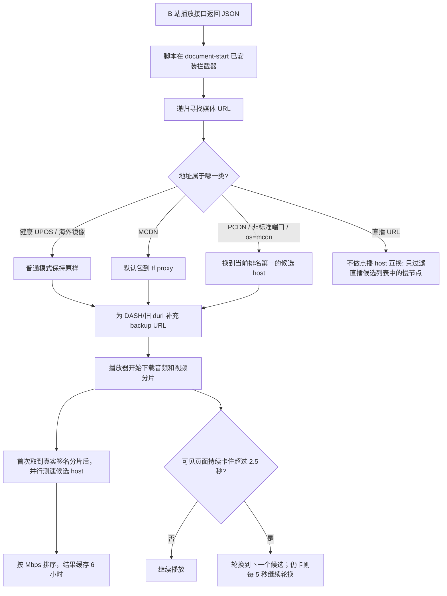

# `realzza/bilibili-accelerator` 实现原理与证据审读

> 面向不了解网络、IP、CDN 的读者。<br>
> 审读对象：`realzza/bilibili-accelerator` v0.4.0，提交 [`6cba8c8`](https://github.com/realzza/bilibili-accelerator/tree/6cba8c8b23ad01a152d186420081284b6eda1f77)。<br>
> 审读日期：2026-08-04。本文把“代码实际做了什么”“项目文档提出过什么”“外部 issue 能证明什么”分开陈述。

## 先说结论

这个项目不是 VPN，也没有把美国用户“送回中国”。它做的事更像：

1. B 站给网页播放器一张“去哪里取视频”的地址清单；
2. 脚本在播放器真正开始下载前看到这张清单；
3. 它识别疑似 PCDN/MCDN 的不稳定地址；
4. 对必须替换的地址，保留视频路径和签名参数，只换服务器名称；
5. 它拿同一个真实视频分片去测试 8 个候选服务器，按实际吞吐量排序；
6. 如果持续卡顿，它依次切换后续视频分片使用的服务器，并给播放器补充备用地址。

因此，它优化的是“B 站把你分配到哪条取视频路线”，不是提高你的宽带套餐速度。若卡顿来自错误的 CDN 调度，它可能很有效；若问题来自 Wi-Fi、运营商拥塞、版权限制、B 站源文件或设备解码，它无能为力。

当前 v0.4.0 的实现明显比早期 [`docs/investigation.md`](https://github.com/realzza/bilibili-accelerator/blob/6cba8c8b23ad01a152d186420081284b6eda1f77/docs/investigation.md) 更成熟。早期文档把 `*ov` 海外镜像列为默认替换对象；当前代码在普通模式下会保留它们，并把境内、境外候选全部测速。这一改变与项目自己的 [issue #26](https://github.com/realzza/bilibili-accelerator/issues/26) 直接相关。

## 一、先补齐最少的网络知识

### 1. URL、域名、IP 分别是什么

以这个简化地址为例：

```text
https://xy1x2x3x4xy.mcdn.bilivideo.cn:8082/v1/resource/123.m4s?deadline=...&upsig=...
|---| |----------------------------| |--| |-------------------| |----------------------|
协议              主机名             端口           路径                 查询参数
```

- **域名/主机名**是人和程序使用的服务器名称，例如 `upos-sz-mirrorcosov.bilivideo.com`。
- **DNS**像通讯录，把域名查成可连接的 IP 地址。
- **IP**像服务器在网络上的门牌号。
- **端口**像门牌下的具体入口。HTTPS 通常用 443；8082、4483 等非标准端口在这个项目里是 PCDN 的强烈信号，但不是普遍适用于整个互联网的定律。
- **路径和查询参数**告诉服务器要哪一个视频分片，并携带有效期、签名等授权信息。

这个脚本主要不是改 DNS 或直接选择 IP，而是把 URL 的“主机名”换掉，让浏览器去另一组服务器取同一个路径。

### 2. CDN 为什么存在

如果所有人都从 B 站唯一的一台中心服务器下载视频，距离远、成本高，也很容易堵塞。CDN 会把视频副本放到许多边缘服务器。你可以把它想成连锁仓库：

- 热门视频可能已经放在附近仓库，拿货很快；
- 冷门视频可能不在附近缓存，需要回源或被分配到质量较差的节点；
- 同一个 CDN 对东京用户可能快，对纽约用户可能慢；
- “延迟低”只说明服务器很快回应，不等于后续持续下载速度高。

原项目关于“冷门视频更容易 cache miss”的说法是合理的工程解释，但引用的 issue 没有提供严格的热门度 × 缓存命中 × 速度统计。因此本文把它视为**合理机制假设**，不是已经被这些 issue 定量证明的事实。

### 3. UPOS、MCDN、PCDN、Akamai 怎么理解

这些名称在社区资料里的用法不总是严格一致，最安全的理解是：

| 名称 | 在本项目里的实际含义 | 项目怎么处理 |
| --- | --- | --- |
| UPOS / mirror | 一批常规视频镜像主机，如阿里、腾讯、华为以及它们的海外 `*ov` 版本 | 普通模式下健康地址不动；需要时作为替换/测速候选 |
| MCDN | `*.mcdn.bilivideo.{cn,com,net}` 一类地址，经常带非标准端口 | 默认包装到 `proxy-tf-all-ws.bilivideo.com/?url=原地址` |
| PCDN | 更像由家庭宽带、边缘设备或 P2P 资源参与的视频分发节点 | 用域名、IP、端口、`os=mcdn` 等信号识别后，换到测得更快的 UPOS 主机 |
| Akamai | 第三方商业 CDN，常见于 `*.akamaized.net` | 默认不改，也不参与自动测速；仅高级选项可强制改写 |

不要把“MCDN”和“PCDN”理解成两个边界绝对清楚的官方分类。代码关心的不是名词纯度，而是这个地址是否表现出住宅节点、非标准端口、`os=mcdn` 等不稳定路线特征。

### 4. DASH、分片和签名 URL

B 站网页常用 DASH：声音和画面是两条独立流，每条流又由许多小分片组成。播放器先从播放接口拿到 `baseUrl` 和 `backupUrl`，再不断下载 `.m4s` 等分片。

这些地址往往是带期限和签名的。项目成立的关键前提是：**B 站一组兼容 UPOS 镜像能接受同样的路径和查询签名，因此只换主机也能取到同一个分片。** 当前 [`replaceHost`](https://github.com/realzza/bilibili-accelerator/blob/6cba8c8b23ad01a152d186420081284b6eda1f77/src/core/rewrite.js#L295-L307) 正是保留路径和查询参数、改成 HTTPS、替换 host 并清除旧的非标准端口。

这不是对任何 CDN 都成立。代码注释明确说 Akamai 用 UPOS 签名路径测试会返回 403，所以 Akamai 被排除在自动候选池之外（[`CANDIDATE_POOL`](https://github.com/realzza/bilibili-accelerator/blob/6cba8c8b23ad01a152d186420081284b6eda1f77/src/core/rewrite.js#L45-L70)）。这也是“不能看到 CDN 就随便互换”的最好例子。

## 二、一次播放在脚本里经历什么



### 第 1 步：必须比播放器更早运行

用户脚本以 `document-start` 注入；扩展版的 content script 也在 `document_start` 运行（[`manifest`](https://github.com/realzza/bilibili-accelerator/blob/6cba8c8b23ad01a152d186420081284b6eda1f77/src/extension/manifest.json#L14-L24)）。

浏览器扩展的 content script 通常处于隔离环境，直接改它自己的 `fetch` 不一定影响网页。因此扩展版会再插入一个真正运行在页面上下文的脚本，让它能 patch B 站页面看到的 `fetch`、XHR 和全局变量（[`content.js`](https://github.com/realzza/bilibili-accelerator/blob/6cba8c8b23ad01a152d186420081284b6eda1f77/src/extension/content.js#L8-L17)）。

### 第 2 步：堵住播放地址可能进入页面的多个入口

当前代码同时拦截：

- `JSON.parse`：若原始 JSON 文本含有 B 站媒体信号，解析后立刻改对象；
- `fetch`：既能改即将发出的分片 URL，也能克隆播放 API 的 JSON 响应、改写后重建 `Response`；
- `XMLHttpRequest`：改 `open()` 的请求 URL，并在 `load` 后用 getter 向播放器暴露修改后的 `responseText/response`；
- `window.__playinfo__`、`window.__INITIAL_STATE__`：安装 getter/setter，赋值时改写；
- `window.__NEPTUNE_IS_MY_WAIFU__`：覆盖直播页的初始状态。

对应代码见 [`patchJsonParse`、`patchFetch`、`patchXHR`、`patchGlobalPlayInfo`](https://github.com/realzza/bilibili-accelerator/blob/6cba8c8b23ad01a152d186420081284b6eda1f77/src/page/bili-accelerator.page.js#L495-L714) 和最终安装顺序（[`L2215-L2223`](https://github.com/realzza/bilibili-accelerator/blob/6cba8c8b23ad01a152d186420081284b6eda1f77/src/page/bili-accelerator.page.js#L2215-L2223)）。

它特意不读取二进制媒体 `fetch` 的 response body，避免在 Safari 后台标签页里额外 tee/读取数据流干扰 MSE 播放（[`L550-L569`](https://github.com/realzza/bilibili-accelerator/blob/6cba8c8b23ad01a152d186420081284b6eda1f77/src/page/bili-accelerator.page.js#L550-L569)）。这说明脚本修改的是“地址和播放清单”，不是视频内容本身。

### 第 3 步：递归找 URL，但设置安全边界

播放 API 的 JSON 很深，音频、视频、番剧和旧格式字段也不一致。核心的 [`rewriteObject`](https://github.com/realzza/bilibili-accelerator/blob/6cba8c8b23ad01a152d186420081284b6eda1f77/src/core/rewrite.js#L536-L576) 不依赖固定字段名，而是遍历数组和对象中的所有字符串：

- 默认最多 20 层；
- 用 `WeakSet` 防止循环引用造成死循环；
- 只有看起来像 B 站媒体、且路径符合 `.m4s/.mp4/.flv/.m3u8`、`/upgcxcode/` 或 `/v1/resource/` 才进入改写。

优点是兼容多种 payload；代价是它是一个较广的全对象扫描器，B 站若改变数据结构或浏览器限制 getter 覆盖，仍可能漏掉或失效。

## 三、它怎样判断“这是该绕开的地址”

当前 [`classify`](https://github.com/realzza/bilibili-accelerator/blob/6cba8c8b23ad01a152d186420081284b6eda1f77/src/core/rewrite.js#L219-L292) 综合多个信号：

| 信号 | 例子 | 代码判断 | 为什么有用 |
| --- | --- | --- | --- |
| MCDN 后缀 | `xy...mcdn.bilivideo.cn` | 匹配 `.mcdn.bilivideo.{cn,com,net}` | 已知媒体分发家族 |
| 编码 IP 主机 | `xy153x35x231x78xy...` | 专门的 `XY_MCDN_RE` | 名字中直接编码了节点 IP |
| 纯 IP | `1.2.3.4:8082` | IPv4 正则 | 常见于直接分配边缘/住宅节点 |
| 非默认端口 | `:8082`、`:4483` | 不是空、80、443 | 社区经验中的 PCDN 强信号 |
| 查询参数 | `os=mcdn` | URL 参数检查 | 即使域名改名也能识别 |
| 已知 P2P 域名 | `*.mountaintoys.cn` 等 | 后缀/固定主机列表 | 补足只靠端口可能漏掉的情况 |
| 302 中转主机 | `upos-...302...` | 只查 `upos-` 第一段中的 `302` | 这些主机随后跳转到住宅 P2P 节点 |
| 调度器 | `*.szbdyd.com?...xy_usource=...` | 读取 `xy_usource` | 直接解包到调度器给出的来源 host |

已知 P2P 列表还包含 `.nexusedgeio.com`、`.ahdohpiechei.com`、`upos-sz-mirror14b.bilivideo.com`；详见 [`isKnownP2pHost`](https://github.com/realzza/bilibili-accelerator/blob/6cba8c8b23ad01a152d186420081284b6eda1f77/src/core/rewrite.js#L94-L124)。

这里最值得肯定的是“行为信号 + 小量域名补丁”的组合。只维护域名黑名单很脆弱，B 站换一个域名就失效；端口和 `os=mcdn` 能覆盖未来新名字。但“所有带非默认端口的播放 URL 都是 PCDN”仍是社区启发式规则，不是互联网协议保证，因此代码允许关闭 `portHeuristic`。

## 四、分类之后到底怎么改

核心决策顺序在 [`rewriteUrlDetail`](https://github.com/realzza/bilibili-accelerator/blob/6cba8c8b23ad01a152d186420081284b6eda1f77/src/core/rewrite.js#L332-L396)：

1. 功能关闭、不是媒体 URL、已经是代理地址：忽略；
2. 点播替换逻辑遇到 `/live-bvc/`：跳过；
3. `szbdyd` 且有 `xy_usource`：改到该来源 host；
4. MCDN 且策略为默认 `proxy-all`：包装到 `proxy-tf-all-ws.bilivideo.com`；
5. PCDN、其他 MCDN，或强制模式下的 B 站 CDN：换到当前目标 host；
6. 其他健康 CDN：保持原样。

普通 `bad-only` 模式不会主动把 `mirrorcosov/mirroraliov/mirrorhwov` 改到境内。`force` 模式则会把所有已知 B 站视频 CDN 改到测速选出的目标，包括海外镜像。这一行为有单元测试覆盖（[`v2-core.test.js`](https://github.com/realzza/bilibili-accelerator/blob/6cba8c8b23ad01a152d186420081284b6eda1f77/test/v2-core.test.js#L312-L359)）。

### MCDN 的“代理”不是普通 host swap

普通替换：

```text
https://旧主机/路径?签名
→ https://新主机/路径?签名
```

MCDN 默认代理：

```text
https://xy....mcdn.bilivideo.cn:8082/v1/resource/123.m4s?签名
→ https://proxy-tf-all-ws.bilivideo.com/?url=<经过 URL 编码的完整原地址>
```

也就是说，tf proxy 收到原地址后代取或转发；这与“把路径原样放在另一镜像 host 上”是两套机制。BiliUniverse 当前模块也把 MCDN 单独配置到这个 proxy，而把 PCDN 配到普通 UPOS host（[模块配置](https://raw.githubusercontent.com/QingRex/LoonKissSurge/refs/heads/main/Surge/Official/%F0%9F%8D%9F%20BiliRedirect.official.sgmodule)）。

## 五、为什么 v0.4.0 不再迷信一个固定 CDN

### 1. 候选池同时包含境内和海外节点

默认 8 个候选包括：

- 海外：`mirrorcosov`、`mirroraliov`、`mirrorhwov`；
- 境内/常规：`mirrorali`、`tf-all-hw`、`mirrorhw`、`mirrorcos`、`tf-all-tx`。

候选定义和注释见 [`CANDIDATE_POOL`](https://github.com/realzza/bilibili-accelerator/blob/6cba8c8b23ad01a152d186420081284b6eda1f77/src/core/rewrite.js#L45-L70)。代码注释提到维护者从 Seattle 测得海外镜像约 33–70 Mbps、境内约 3–20 Mbps；这是维护者写入代码的现场经验，没有随仓库附原始测试表，所以应视为**项目自报测量**，不是普遍结论。

项目 [issue #26](https://github.com/realzza/bilibili-accelerator/issues/26) 提供了反例背景：东京用户在 v0.3.0 发现 `mirrorcosov` 不一定比 `mirrorcos` 慢，但当时自动池只有境内节点，脚本会把原本可用的海外节点改走。v0.4.0 的正确修复不是反过来永远选择海外，而是把两档都测。

### 2. 用真实视频分片测吞吐，不只测 ping 或响应头

脚本第一次在播放 payload 中找到真实签名分片后：

1. 把同一个分片 URL 的 host 依次换成所有候选；
2. 并行发送 GET；
3. 最多读取每个候选前 768 KiB；
4. 单个候选 4 秒超时；
5. 用 `字节数 × 8 ÷ 实际传输秒数` 得出 Mbps；
6. 按 Mbps 从高到低排序，TTFB 只在吞吐相同时破平局。

实现见 [`probeHost` 与 `scheduleProbe`](https://github.com/realzza/bilibili-accelerator/blob/6cba8c8b23ad01a152d186420081284b6eda1f77/src/page/bili-accelerator.page.js#L758-L902)，排序见 [`rankHosts`](https://github.com/realzza/bilibili-accelerator/blob/6cba8c8b23ad01a152d186420081284b6eda1f77/src/core/rewrite.js#L502-L533)。

这比测 ping 更贴近视频需求：一个仓库可以秒接电话，但搬货很慢。当前 8 个候选理论上每轮最多额外读取约 6 MiB，实际还受 4 秒超时和提前取消影响。结果按“时区 + 浏览器语言”作为粗略网络环境键，缓存在 `localStorage` 6 小时（[`L18-L19`](https://github.com/realzza/bilibili-accelerator/blob/6cba8c8b23ad01a152d186420081284b6eda1f77/src/page/bili-accelerator.page.js#L18-L19)、[`L234-L280`](https://github.com/realzza/bilibili-accelerator/blob/6cba8c8b23ad01a152d186420081284b6eda1f77/src/page/bili-accelerator.page.js#L234-L280)）。

局限也很明确：时区/语言不等于真实 ISP 或地理位置；一次短测速不保证半小时后仍最快；并行测速会制造一小段额外流量和竞争。

### 3. 给播放器备用路线

脚本会为 DASH 的 `baseUrl/base_url` 和旧 `durl` 生成 host-swapped 备用 URL，去重后最多 8 条（[`enrichBackups`](https://github.com/realzza/bilibili-accelerator/blob/6cba8c8b23ad01a152d186420081284b6eda1f77/src/page/bili-accelerator.page.js#L343-L417)）。这样播放器自身若支持 `backupUrl` 回退，就能使用完整候选链。

### 4. 卡住后轮换，而不是直接操纵正在播放的 MSE

当前代码监听 `<video>` 的 `waiting/stalled/playing/canplay`。页面可见、视频没有暂停或结束、`readyState < 3` 且持续 2.5 秒才认定卡顿；之后选下一个候选，仍未恢复就每 5 秒继续轮换（[`handleStall`](https://github.com/realzza/bilibili-accelerator/blob/6cba8c8b23ad01a152d186420081284b6eda1f77/src/page/bili-accelerator.page.js#L904-L1030)）。

要注意措辞：设计文档曾提议“直接重指向 MSE、轻微 seek”；当前实现没有这样做。它通过 `recovery.avoidHost` 让接下来 15 秒里发往卡顿 host 的新分片请求进入 force 改写，并轮换 `pcdnHost`。已经下载或正在解码的那一段不会被魔法搬走。因此它是“后续请求自愈”，不是无缝重启当前字节流。

后台标签页还会被浏览器节流。当前实现对隐藏页面不立即切 CDN，而是在回到前台后重新检查；这能减少把浏览器暂停误判为服务器故障。

## 六、直播和 P2P 上传是两条特殊分支

### 直播

直播 CDN 路径与点播 UPOS 不兼容，所以 `/live-bvc/` 不做普通 host swap。直播接口会给出 `url_info: [{host, extra}]` 候选列表；代码删除其中的 MCDN/PCDN 项，但如果删完会一个都不剩，就保留原列表，避免把直播彻底弄坏（[`filterLiveUrlInfo`](https://github.com/realzza/bilibili-accelerator/blob/6cba8c8b23ad01a152d186420081284b6eda1f77/src/core/rewrite.js#L578-L654)）。

### P2P/WebRTC 带宽保护

高级开关 `p2pGuard` 默认关闭。打开并刷新页面后，脚本会：

- 把 `PCDNLoader`、`BPP2PSDK`、`SeederSDK` 替换成空实现；
- 把 `RTCPeerConnection` 等构造器替换成会抛 `NotAllowedError` 的实现。

代码见 [`installP2PGuard`](https://github.com/realzza/bilibili-accelerator/blob/6cba8c8b23ad01a152d186420081284b6eda1f77/src/page/bili-accelerator.page.js#L716-L754)。其思路来自社区对直播后台上传的报告；[Bilibili-Evolved discussion #5404](https://github.com/the1812/Bilibili-Evolved/discussions/5404) 中，报告者声称一个月 Chrome 上传超过 350 GB，并给出了禁用 WebRTC 的示例代码。

这份 discussion 是用户个案，不是平台级审计。并且当前 guard 在 B 站页面中阻断的是整个 WebRTC 构造入口，不只某个精确识别的上传连接，理论上会影响页面上其他需要 WebRTC 的功能。默认关闭是合理的。

## 七、`investigation.md` 和关联 issue 到底能证明什么

原 `investigation.md` 列了 5 个外部来源。它们更适合证明“社区确实观察到这些地址并实践过 host replacement”，不足以证明“某一 CDN 在所有地区都慢”。

### 1. `bilibili-helper-o` issue #713

[issue #713](https://github.com/bilibili-helper/bilibili-helper-o/issues/713) 在 2020-06-04 提出锁定/替换 UPOS、修改 hosts，以及使用 B 站官方视频诊断页。它还举例说港澳台 `mirrorakam` 常解析到美国 IP，手工锁到香港/台湾 IP 可缓解中国大陆访问。

能支持：

- “只换 CDN/解析目标”是长期存在的社区实践；
- B 站确实曾提供官方视频诊断页。

不能直接支持：

- 2026 年纽约用户应该选哪个 host；
- Akamai、七牛或任何节点今天一定慢；
- 原脚本的动态测速与自愈逻辑一定有效。

它年代较早、场景偏中国大陆访问港澳台内容，和当前海外观看中国站不是同一个网络方向。

### 2. `yt-dlp` issue #12421 与 `Cats-Team/AdRules` issue #217

[yt-dlp #12421](https://github.com/yt-dlp/yt-dlp/issues/12421) 在 2025-02-20 展示了同一个视频的多种音视频格式都返回 `xy...mcdn.bilivideo.cn`，端口包括 8082 和 4483，并请求 yt-dlp 增加源 URL 替换。它还给出了将 MCDN 换成普通 UPOS、把 `szbdyd` 解到 `xy_usource` 的脚本片段。

[AdRules #217](https://github.com/Cats-Team/AdRules/issues/217) 是同一用户、同一天、同一视频和同一环境。日志显示：

- `mcdn.bilivideo.cn` 命中了 AdRules DNS 黑名单；
- AdGuard Home 返回了用于负缓存的假响应；
- 随后 yt-dlp 对 `:8082` 连续 10 次 read timeout；
- issue 最终以 `not planned/stale` 关闭。

关键判断：这两条不能算两份独立证据。它们是一个相互引用的事件，而且存在 DNS 拦截混杂。它们强有力地证明“API 会返回 MCDN 非标准端口地址、DNS 黑名单会让只拿到这些地址的下载器失败”，但不能单凭这组日志证明“未被拦截的 MCDN 本身在所有网络都慢”。原 `investigation.md` 把 #217 概括成 MCDN read timeout 没错，但如果据此推断 MCDN 天生慢，就超出了证据。

### 3. BiliUniverse Redirect 模块

[BiliRedirect Surge 模块](https://raw.githubusercontent.com/QingRex/LoonKissSurge/refs/heads/main/Surge/Official/%F0%9F%8D%9F%20BiliRedirect.official.sgmodule) 明确区分 OverseaVideo、PCDN、MCDN，并为 MCDN 使用 `proxy-tf-all-ws`；也列出 4480、4483、8000、8082、9102 等端口。

它能证明这是一个被实际维护、实际部署的分类和重定向方案；但配置文件本身不是性能实验，不能证明默认 host 对每个地区最优。

### 4. Greasy Fork CDN Switcher

原文还引用 “Bilibili Video CDN Switcher”，用于证明用户脚本切换 CDN 和常见 host 列表的既有实践。本次自动审读访问该页面时收到 403，因此本文不使用其页面内容支撑任何更具体结论，只保留[原链接](https://greasyfork.org/en/scripts/500213-bilibili-video-cdn-switcher)供人工复核。

### 5. 后续设计文档引用的资料

虽然它们不在最早的 `investigation.md` 五项里，却直接影响了当前代码：

- [Bilibili-Evolved discussion #5438](https://github.com/the1812/Bilibili-Evolved/discussions/5438)：记录 `*.edge.mountaintoys.cn`、非标准端口、住宅 IP、`os=mcdn`，并称替换到普通 `bilivideo.com` CDN 后仍可用。它直接解释了当前的端口和 `os=mcdn` 启发式。
- [Bilibili-Evolved discussion #5404](https://github.com/the1812/Bilibili-Evolved/discussions/5404)：报告 WebRTC 后台上传并提供禁用代码，解释了可选 `p2pGuard`。
- [SukkaW/MBGTEB issue #26](https://github.com/SukkaW/Make-Bilibili-Great-Than-Ever-Before/issues/26)：建议补充 `mountaintoys`、`.mcdn.bilivideo.net`、`szbdyd`、纯 IP + `os=mcdn`，并拦截直播接口和 `__NEPTUNE_IS_MY_WAIFU__`。当前 v0.4.0 已能在代码中对应到这些点。
- [realzza/bilibili-accelerator issue #26](https://github.com/realzza/bilibili-accelerator/issues/26)：揭示 v0.3.0 只测境内候选、强制把可用 `mirrorcosov` 改到境内的问题，解释了 v0.4.0 为什么扩大候选池并改按吞吐排序。

### 证据强度总表

| 结论 | 证据强度 | 原因 |
| --- | --- | --- |
| B 站播放地址会出现多种 UPOS/MCDN/PCDN 风格 host | 高 | 多份实际 URL、当前代码测试和社区配置相互印证 |
| 改 host 并保留路径/参数对一组兼容 UPOS 镜像可用 | 中高 | 多个实现采用，当前项目也以真实分片探测；但不是官方兼容性承诺 |
| `mountaintoys`、非标准端口、`os=mcdn` 是实用 PCDN 信号 | 中高 | 有具体 URL/域名资料并进入多项目规则；仍属于启发式 |
| 所有 MCDN/PCDN 对所有用户都慢 | 低 | 网络高度依地区/ISP；关键 timeout 案例还受 DNS 黑名单干扰 |
| 海外镜像一定比境内镜像慢或快 | 低 | issue #26 与维护者 Seattle 测量已经说明地区差异；应逐用户测速 |
| 禁用 WebRTC 一定节省大量上传 | 中 | 有大流量个案和技术路径，但缺少跨用户统计；效果取决于页面是否实际启用 P2P |
| 冷门视频更容易因 cache miss 卡顿 | 中 | CDN 机制合理且符合报告模式，但引用资料没有提供定量因果检验 |

## 八、早期调查、v2 设计和当前 v0.4.0 不要混读

| 能力 | 早期 `investigation.md` | `design-v2.md` 提议 | v0.4.0 当前代码 |
| --- | --- | --- | --- |
| MCDN proxy / PCDN host 替换 | 已有 | 保留并泛化 | 已实现 |
| XHR 拦截 | 未覆盖 | 建议加入 | 已实现 |
| 非标准端口、`os=mcdn` | 未覆盖 | 建议加入 | 已实现 |
| 境内外候选自动测速 | 固定目标 | 建议 probe + rank | 已实现，按吞吐排序 |
| DASH 备用 URL | 未提 | 建议候选链 | 已实现 |
| 卡顿自愈 | 未提 | 提议直接 live re-point | 已实现“后续请求轮换”，未直接重绑 MSE |
| P2P/WebRTC guard | 未提 | 建议可选 | 已实现，默认关 |
| 直播 PCDN | 未覆盖 | 后续资料提出 | 通过过滤 `url_info` 实现 |
| Service Worker / MSE 专门拦截 | 无 | 后期提议 | 未实现 |
| 完整 `bilibili.tv` 适配 | 无 | 建议验证 | manifest 有域名匹配，但不能据此认定所有 payload 已完整验证 |

所以，读 `investigation.md` 能理解项目起点，但理解当前行为必须以 v0.4.0 代码为准。

## 九、可靠性、隐私和潜在风险

### 已做得比较稳的地方

- 核心改写函数与浏览器 UI 分离，便于单元测试；
- 默认只处理已判断为慢/PCDN 的地址，健康 CDN 不动；
- Akamai 默认不动；
- 二进制媒体 response 不被读取或重建；
- 诊断报告只保留 `fromHost/toHost/reason`，不保存完整分片查询参数。代码特别说明查询中可能含 `mid`、`buvid`、IP 派生 `oi` 和签名 token（[`record`](https://github.com/realzza/bilibili-accelerator/blob/6cba8c8b23ad01a152d186420081284b6eda1f77/src/page/bili-accelerator.page.js#L283-L303)）；
- 直播过滤永不删除最后一个可用 host；
- 仓库使用 MIT License，构建时由同一份 core + page 生成 userscript 和扩展，减少两套实现漂移（[`build.mjs`](https://github.com/realzza/bilibili-accelerator/blob/6cba8c8b23ad01a152d186420081284b6eda1f77/scripts/build.mjs#L8-L47)）。

### 仍要知道的风险

1. **它 monkey-patch 页面基础 API。** 全局替换 `JSON.parse`、`fetch`、XHR 和几个 window 属性，B 站改前端实现后可能兼容性失效。
2. **测速不是免费。** 一轮最多约 6 MiB 额外读取，并与正常播放共享带宽。
3. **host-swap 是兼容性假设。** 兼容 UPOS 镜像大多可行，但不同 CDN 的签名、Range、CORS 可能不同；Akamai 已展示这种边界。
4. **自愈不保证立即恢复。** 它影响后续请求和备用链，不是直接重建当前 MSE 会话。
5. **P2P guard 较宽。** 开启后会拦 B 站页面里的整个 WebRTC 构造入口。
6. **缓存环境键很粗。** 时区 + 语言无法区分同一用户换 Wi-Fi、蜂窝网络或 VPN；6 小时内可能继续使用已变化的旧排名。
7. **部分注释已过时。** 页面脚本 [`L470-L473`](https://github.com/realzza/bilibili-accelerator/blob/6cba8c8b23ad01a152d186420081284b6eda1f77/src/page/bili-accelerator.page.js#L470-L473) 仍写 force mode 排除 `*ov`，但核心当前行为和测试都表明 force 会覆盖 `*ov`。应相信可执行代码与测试，同时把这视为维护性小问题。

### 本次验证结果

在浅克隆的上述提交上，用 Node 的原生测试运行器执行 `node --test`：

```text
tests 74
pass 74
fail 0
duration_ms 4184.559625
```

这能证明仓库定义的 74 个单元/烟雾场景当前通过，包括分类、XHR/fetch、备选链、吞吐排名、卡顿轮换、直播过滤和诊断脱敏。它不能替代纽约、东京或具体 ISP 上的真实视频 A/B 测试。

## 十、它和本仓库 Loon 插件是什么关系

本工作区的 [`Bilibili-US-Accelerator.plugin`](../Bilibili-US-Accelerator.plugin) 不是原项目的移植版，而是更小、更静态的网络层方案。

| 对比项 | `realzza/bilibili-accelerator` | 本仓库 Loon 插件 |
| --- | --- | --- |
| 运行位置 | B 站网页 JavaScript 页面上下文 | iOS/iPadOS 网络代理层 |
| 主要对象 | 浏览器网页播放器 | 目标是官方 App 请求 |
| 改写方式 | 读播放 JSON、改 payload 和后续分片请求 | 正则匹配 URL 头，只换 host |
| 目标选择 | 8 个候选真实分片测速、缓存、轮换 | 永久固定 `upos-sz-mirrorali.bilivideo.com` |
| MCDN | 默认 tf proxy，也可替换 | 当前正则不匹配 `*.mcdn.bilivideo.cn`，所以 `force-http-engine-hosts` 虽列端口，MCDN URL 本身不会被两条 Rewrite 规则改写 |
| PCDN 新域名/纯 IP | 端口、`os=mcdn`、域名规则综合识别 | 不识别 |
| Akamai | 默认不改；高级选项可改；不自动测速 | 完全不匹配，保持原样 |
| 卡顿反馈 | 监听播放器状态并轮换 | 无 |
| 证书 | 普通 userscript 不需自签 CA | HTTPS host rewrite 依赖 Loon MITM 证书和 hostname 覆盖 |
| P2P 上传 | 可选 WebRTC guard | 不处理 |

本地插件的核心规则在 [`Bilibili-US-Accelerator.plugin:10-21`](../Bilibili-US-Accelerator.plugin#L10-L21)：

- 第 13 行只是让非标准端口进入 Loon HTTP 引擎；
- 第 17–18 行真正改写的只有 `upos-*.bilivideo.com` 和 `cn-hk-eq-*.bilivideo.com`；
- 第 20–21 行列出 HTTPS MITM host；
- 路径和查询参数不改，Akamai 不匹配。

这意味着本地插件借用了“换 CDN host、保留签名路径”的核心思想，但没有原项目最重要的分类、MCDN proxy、动态测速、备用链和卡顿闭环。反过来，原项目明确只承诺网页端；它不能直接替代 Loon 对原生 App 的网络层处理。

另一个需要留意的实现边界：本地 Rewrite 正则能匹配任意 `upos-*.bilivideo.com`，但 MITM `hostname` 只列出 `upos-sz-mirror*`、`upos-tf-all-*` 和 `cn-hk-eq-*`。HTTPS 原始 host 若落在正则能匹配、MITM 列表却未覆盖的其他 UPOS 家族，Loon 是否能看到并重写要以真机请求记录为准。

## 十一、给非技术用户的最终解释

### 它为什么可能让视频变快？

因为 B 站给你的默认取件仓库不一定最适合你。脚本保留“拿哪一个视频”的凭证，只把“去哪个仓库拿”换成实测更快的候选。

### 它会不会改变画质？

它不重新编码视频，理论上不会主动降画质；它替换的是同一音视频分片的来源地址。但不兼容的 CDN/签名组合可能请求失败，所以项目默认保守，并排除 Akamai 自动候选。

### 它是不是代理/VPN？

大多数 UPOS 替换不是 VPN，只是浏览器直连另一 CDN host。MCDN 的默认 `tf proxy` 分支确实多经过一个代理型地址，但仍不是把整台设备流量送进 VPN。

### 它能解决地区版权限制吗？

不能。脚本解决的是已经获得播放地址后的传输路线，不负责取得你原本无权获得的内容授权。

### 为什么热门视频正常、冷门视频卡？

最可能的解释是热门内容在更多附近 CDN 缓存中，而冷门内容更容易被分到需回源或质量不稳的节点。但这是合理解释，不是本文引用资料已经完成的因果证明。

### 为什么不能简单永远固定阿里或腾讯？

因为 CDN 表现依地区、ISP、时间、视频和缓存状态变化。东京 issue 和 Seattle 自测方向都说明“一刀切”会伤害一部分用户；当前项目用实测吞吐排序比固定 host 更合理。

### 最准确的一句话

`realzza/bilibili-accelerator` 是一个运行在 B 站网页内部的“播放地址调度纠错器”：先识别疑似不稳定的分发节点，再用真实分片给境内外候选测速，保留签名、替换兼容 host，并在后续卡顿时轮换路线。

## 十二、源码与讨论索引

### 原仓库

- [README（当前功能边界）](https://github.com/realzza/bilibili-accelerator/blob/6cba8c8b23ad01a152d186420081284b6eda1f77/README.md)
- [`docs/investigation.md`（早期调查）](https://github.com/realzza/bilibili-accelerator/blob/6cba8c8b23ad01a152d186420081284b6eda1f77/docs/investigation.md)
- [`docs/design-v2.md`（提案，不能全部当成现状）](https://github.com/realzza/bilibili-accelerator/blob/6cba8c8b23ad01a152d186420081284b6eda1f77/docs/design-v2.md)
- [`src/core/rewrite.js`（分类与改写核心）](https://github.com/realzza/bilibili-accelerator/blob/6cba8c8b23ad01a152d186420081284b6eda1f77/src/core/rewrite.js)
- [`src/page/bili-accelerator.page.js`（拦截、测速、恢复和 UI）](https://github.com/realzza/bilibili-accelerator/blob/6cba8c8b23ad01a152d186420081284b6eda1f77/src/page/bili-accelerator.page.js)
- [`test/`（74 个测试所覆盖的行为）](https://github.com/realzza/bilibili-accelerator/tree/6cba8c8b23ad01a152d186420081284b6eda1f77/test)

### 外部 issue / discussion

- [bilibili-helper-o #713：锁定/替换 CDN 与官方诊断页](https://github.com/bilibili-helper/bilibili-helper-o/issues/713)
- [yt-dlp #12421：播放接口返回大量 MCDN URL 与替换请求](https://github.com/yt-dlp/yt-dlp/issues/12421)
- [Cats-Team/AdRules #217：同一案例中的 DNS 黑名单与 read timeout](https://github.com/Cats-Team/AdRules/issues/217)
- [Bilibili-Evolved #5438：`mountaintoys`、端口、住宅 IP、`os=mcdn`](https://github.com/the1812/Bilibili-Evolved/discussions/5438)
- [Bilibili-Evolved #5404：WebRTC 后台上传报告与禁用示例](https://github.com/the1812/Bilibili-Evolved/discussions/5404)
- [SukkaW/MBGTEB #26：补充 PCDN 与直播过滤建议](https://github.com/SukkaW/Make-Bilibili-Great-Than-Ever-Before/issues/26)
- [realzza/bilibili-accelerator #26：海外镜像误改写与候选池问题](https://github.com/realzza/bilibili-accelerator/issues/26)
